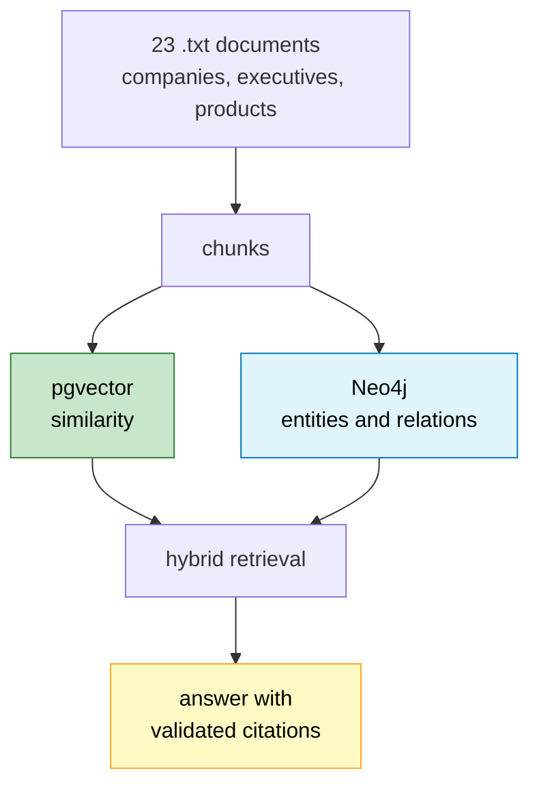
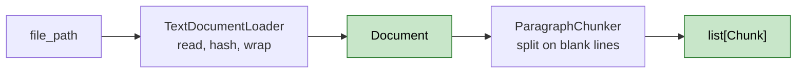

# Lesson 0. The foundation, written down after the fact

This lesson is retrospective. Everything in it already existed before
`Instructions1.md` was written, so there is nothing here to type. It explains
the decisions the rest of the course sits on, and it fixes three pieces of
scaffolding that turned out to be junk.

Read it if you want to know why the project is shaped the way it is. Skip to
Step 6 if you only want the cleanups.

---

## What the project is



The claim being tested is narrow and worth stating precisely. Vector RAG
answers single-fact questions well. It cannot follow a relationship. A question
whose answer requires joining two or three facts about different entities is
one that similarity search fails on, no matter how good the embeddings are,
because "OpenAI" and "Azure" are not textually similar. They are connected,
which is a different property and needs a different data structure.

Everything else in this project exists to make that claim measurable.

### Why this corpus

`data/raw/` holds 23 documents about nine companies, nine executives, and a
handful of products. The choice matters more than it looks. A folder of
unrelated blog posts has no relationships to extract, so the graph half of the
system has nothing to do and the whole comparison collapses.

The corpus was picked because the entities genuinely interlock. Microsoft
invests in OpenAI, OpenAI trains on Azure, Microsoft owns Azure, NVIDIA
supplies all of them. Those chains are what a graph can traverse and a vector
index cannot.

One flaw worth knowing, spotted later in Lesson 2:

```text
alphabet_inc.txt      4007 bytes   7 chunks
sam_altman.txt        4017 bytes   8 chunks
...
microsoft.txt         1425 bytes   2 chunks   <- thin
nvidia.txt            1124 bytes   2 chunks   <- thin
openai.txt            1124 bytes   2 chunks   <- thin
satya_nadella.txt     1204 bytes   2 chunks   <- thin
```

Four documents are a third the size of the rest, because they were written
first before the length settled. Questions about those four underperform, and
it looks like a retrieval bug when it is a corpus problem. Better ranking
cannot fix a document that does not contain the answer.

---

## Step 1. The two databases

`docker-compose.yml` runs Postgres and Neo4j side by side.

```text
  postgres    pgvector/pgvector:pg16    :5432    documents, chunks, embeddings
  neo4j       neo4j:5-community         :7687    entities, relations
                                        :7474    browser UI
```

Two stores, on purpose, and it is the decision that shapes the whole project.

```text
  what Postgres is good at        what Neo4j is good at
  ────────────────────────        ─────────────────────
  a passage ranked by similarity  a path between two entities
  scanning 768-dim vectors        walking edges without joins
  transactional writes            variable-depth traversal
```

You can force either one to do the other job. Postgres can store edges in a
table and you can write recursive CTEs; Neo4j has vector indexes now. Both
work badly enough that the comparison this project is testing would be
compromised by the tooling rather than by the ideas.

**The shared chunk id is what makes the split work.** Both stores key on the
same `chunk_id`, so a graph path can jump back to the exact text that asserted
it, and a retrieved passage can jump into the graph neighbourhood around it.
Without that shared key you have two systems, not one.

`pgvector/pgvector:pg16` rather than plain `postgres:16` because the extension
binary has to be in the image. The plain image cannot run `CREATE EXTENSION
vector` no matter what you do.

Both services declare healthchecks:

```yaml
healthcheck:
  test: ["CMD-SHELL", "pg_isready -U rag -d rag"]
  interval: 5s
```

Postgres accepts TCP connections several seconds before it will accept queries.
Without a healthcheck, anything that starts alongside it gets a connection
refused on boot and it looks intermittent.

---

## Step 2. Settings

`app/config/settings.py` is pydantic-settings, one class, every knob in one
place.

```text
  postgres_*            host, port, db, user, password
  neo4j_*               uri, user, password
  ollama_*              base url, chat model, embedding model
  groq_*, openrouter_*  keys and model names
```

The important property is that **every field has a default that matches
docker-compose**, so the app runs with no `.env` at all. Local development
should need zero setup. `.env` is for when you deviate, and for secrets.

That file also contained a bug that survived until Lesson 7. `env_file=".env"`
resolves against the current working directory rather than the file that
declares it, so running from `backend/` looked for `backend/.env` and silently
loaded nothing. Every key read as `None` with no warning. Lesson 7 anchors it
to `Path(__file__).parents[2]`.

---

## Step 3. The domain types

Four dataclasses, no behaviour, no ORM.

```text
  Document                          Chunk
  ────────                          ─────
  document_id    sha256             chunk_id      sha256
  filename                          document_id   FK
  source                            chunk_index
  title                             text
  content                           metadata      dict
  content_hash   sha256
  metadata       dict
  created_at
```

Two things here pay off much later.

**The ids are content-derived, not sequential.** `document_id` is
`sha256("local:" + filename)` and `chunk_id` hashes the document id, the chunk
index, and the chunk text. That means the same input always produces the same
id, so re-ingesting is an upsert that changes nothing rather than a duplicate.
Lesson 4 gets idempotent ingestion almost for free because of this, and Lesson
9's `MERGE` into Neo4j works for the same reason.

**`content_hash` is separate from `document_id`.** The id identifies the file,
the hash identifies its contents. Two different questions: "have I seen this
file?" and "has it changed?" That distinction is unused until Lesson 4, where
it becomes the thing that detects an edited document and triggers a re-ingest.

---

## Step 4. Loading and chunking



`TextDocumentLoader.load` reads with `errors="replace"` so a stray byte
degrades one character rather than killing the run.

`ParagraphChunker` splits on blank lines, then packs paragraphs up to a
character budget with a small overlap. Paragraph boundaries are used because
they are real semantic units that the author already chose, and respecting them
costs nothing.

`IngestionPipeline` is the only thing that composes them, and it stayed pure:
no database, no network, no LLM. That is why `tests/test_ingestion.py` runs in
0.04 seconds with no services up.

The original chunker had a hole. Its loop asked whether a paragraph fit
*alongside what was already accumulated*, and never whether it fit at all, so a
single paragraph longer than the limit sailed straight through and produced an
oversized chunk. `Instructions1.md` fixes that, and its `_split_large_paragraph`
is where the course actually begins.

---

## Step 5. The health endpoint

`app/main.py` started as one route.

```python
@app.get("/health")
def health():
    ...
    return {"status": ..., "postgres": postgres_ok, "neo4j": neo4j_ok}
```

It reports each dependency separately rather than a single boolean. "The app is
down" sends you looking at the app. "Postgres true, Neo4j false" sends you to
the right container. That is the entire value of the endpoint and it took four
lines.

---

## Step 6. Three pieces of junk, now removed

These are real changes, already applied.

### `datetime.utcnow` is deprecated

`Document.created_at` used `default_factory=datetime.utcnow`, which Python 3.12
deprecates. It returns a naive datetime that claims to be UTC without saying
so, which is how timezone bugs start.

```python
# before
created_at: datetime = field(default_factory=datetime.utcnow)

# after
created_at: datetime = field(
    default_factory=lambda: datetime.now(UTC)
)
```

The `lambda` is needed because `datetime.now` takes an argument, so it cannot
be passed as a bare factory.

### `backend/src/backend/__init__.py`

The `uv` project template created this:

```python
def main() -> None:
    print("Hello from backend!")
```

Nothing ever imported it. Its `__pycache__` was the giveaway: every sibling
module had compiled bytecode and this one never did, because nothing had loaded
it. Deleted, along with the `[project.scripts]` entry pointing at it and the
`[build-system]` block. This is an application you run with uvicorn, not a
package you distribute, so there is nothing to build.

### `backend/tests/prefix_test.py`

The throwaway benchmark from Lesson 3, which was meant to be deleted after
running. It sat in `tests/` where pytest collects it, contained no function
named `test_*`, and used a relative path that only resolved from one directory.
A file in a test folder that pytest picks up and finds nothing in is worse than
no file, because it trains you to ignore the collection summary.

Deleted. `pytest tests/ -q` now reports `1 passed`.

---

## Where this leaves you

```text
  working                                    unbuilt
  ───────                                    ───────
  docker-compose, both services healthy      everything else
  settings with safe defaults
  Document and Chunk, sha256 ids
  loader, chunker, pipeline
  one passing test
  GET /health
```

That is the state `Instructions1.md` starts from. The lessons in order:

```text
  1   chunker that handles oversized paragraphs
  2   Postgres schema, pgvector, no index yet
  3   embedding client, batching, retry
  4   idempotent writes, resumable embedding backfill
  5   top-k cosine search, HNSW, and the 250x ORDER BY trap
  6   graph schema, closed label set, validation
  7   extraction on hosted inference
  8   entity resolution
  9   graph writes with MERGE
 10   graph retrieval from Cypher templates
 11+  routing, fusion, citations, API, benchmark, UI
```

One habit worth carrying through all of them. Every number in these lessons
came from running the thing, not from expecting it. That is why Lesson 3 says
batching gained 19% instead of the 10x I predicted, why Lesson 5 says the HNSW
index does nothing at 134 rows, and why Lesson 8 threw away a name-matching
heuristic that looked sensible and merged three different people called Amodei
into one node. Measure, then decide.
