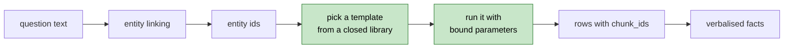

# Lesson 10. Graph retrieval, and ranking by the wrong number

The graph exists. This lesson turns a question into a traversal and back into
citable statements. It also contains a bug that produced perfectly valid facts
that had nothing to do with the question, which is the most instructive kind.

---

## The rule: the model never writes Cypher



`app/graph/queries.py` holds eight named templates. The model does not generate
query text, and nothing concatenates user input into a query.

Two reasons, and the second is the one people forget:

```text
  security         a generated MATCH can read or delete anything the
                   connection is allowed to touch
  reproducibility  the same question produces the same query every
                   time, so a wrong answer is debuggable
```

Generated Cypher makes every wrong answer a one-off. You cannot fix a query you
did not write.

The one place a template is interpolated at all is the relationship type, which
Cypher genuinely cannot parameterise, and that value is checked against the
`RelationType` enum first:

```python
if relation not in set(RelationType):
    raise ValueError(f"unknown relation type: {relation}")
```

---

## Entity linking without a model call

To traverse from "Microsoft" you need its `entity_id`. The obvious approach is
to ask an LLM to pull entity names out of the question. I did not, for a reason
that turned out to matter a lot: Groq's free tier is 200,000 tokens per day, and
by this point in the project I had spent all of it. Free tokens were the scarce
resource.

So linking is string matching against the names and aliases already in the
graph:

```python
@lru_cache(maxsize=1)
def _entity_index() -> tuple[tuple[str, str, str, str], ...]:
    # (normalized surface form, entity_id, name, entity_type)
    ...
    # Longest first so "google cloud platform" wins over "google".
    index.sort(key=lambda item: -len(item[0]))
```

Three details make it work.

**Longest form first.** Without it, "Google Cloud Platform" in a question
matches the shorter "Google" and traverses from the wrong node.

**Word-boundary matching**, not `in`. A substring check would match "AI" inside
"chair" and link an entity that was never mentioned.

**Aliases are searched too**, which is the return on Lesson 8. A question
saying "Anthropic PBC" links to the same node as one saying "Anthropic".

This is free, deterministic, and well suited to a corpus of proper nouns. It
would be the wrong choice for questions that refer to entities obliquely, and
the LLM fallback is the upgrade path when that shows up in the eval.

---

## Templates by question shape

```text
  one entity named       NEIGHBOURS          all edges on that node
  one entity, deeper     TWO_HOP             paths out to distance 2
  two entities named     SHARED_NEIGHBOUR    what sits between them
  aggregation            COUNT_BY_RELATION   degree per relation type
  UI                     NEIGHBOURHOOD_GRAPH nodes and edges to draw
```

The count of linked entities picks the shape. A question naming two entities is
almost always asking what connects them, so it gets `SHARED_NEIGHBOUR` rather
than the union of both nodes' edges.

Every template returns `chunk_ids`. That is not optional. A traversal result
with no provenance cannot be cited, and an uncitable fact is one this system is
not allowed to use.

---

## Verbalising paths

Raw triples make bad prompt text. `(Microsoft, INVESTED_IN, OpenAI)` in a
context block invites the model to copy the shape instead of writing English.

```python
RELATION_PHRASES = {
    "CEO_OF": "is the CEO of",
    "INVESTED_IN": "has invested in",
    "PREVIOUSLY_WORKED_AT": "previously worked at",
    "BASED_ON": "is based on",
    ...
}
```

A two-hop path becomes one sentence:

```text
  (Microsoft) -INVESTED_IN-> (Anthropic) -COMPETES_WITH-> (OpenAI)

  "Microsoft has invested in Anthropic, which competes with OpenAI."
```

Cheap, and it means the model spends its attention on the answer rather than on
decoding notation.

---

## The bug: ranking by confidence

Extraction stores a `confidence` per relation, so ranking facts by it looked
obviously right. Here is what "How is Microsoft connected to OpenAI?" returned:

```text
  [1] Microsoft develops Entra ID.
  [2] Microsoft develops Microsoft Azure.
  [3] Microsoft develops Entra ID External Identities.
  [4] Microsoft develops Entra Domain Services.
  [5] Microsoft develops Entra ID B2C.
```

Every one of those is true, sourced, and useless. OpenAI appears nowhere. The
model then correctly answered `INSUFFICIENT_CONTEXT`, and for a while I thought
the generation step was broken.

The problem is what confidence measures:

```text
  what confidence means            what ranking needs
  ─────────────────────            ──────────────────
  the model was sure this          this fact is relevant to
    triple appears in the text       THIS question
  ~1.0 for almost everything       has to discriminate
```

A signal that is 1.0 for nearly every row cannot order anything. Ranking on it
is ranking on noise, and the Entra facts won on tie-break order alone.

The fix is to score by how much of the question a fact covers:

```python
wanted = {normalize_name(entity.name) for entity in linked}

for fact in facts:
    touched = {normalize_name(name) for name in fact.entities}
    covered = len(wanted & touched)

    # Covering both named entities is what a connection question is
    # asking for, so it dominates. Confidence only breaks ties.
    fact.score = covered * 10.0 + fact.score - 0.1 * fact.hops
```

Coverage times ten, so it dominates. Confidence survives as a tie-break, and a
small hop penalty prefers the shorter path when two facts cover the same
entities.

Same question after the fix:

```text
  [1h 20.85] Microsoft has invested in OpenAI.
  [1h 20.80] Microsoft partners with OpenAI.
  [2h 20.75] Microsoft has invested in Anthropic, which competes with OpenAI.
  [1h 10.90] Microsoft develops Entra ID.
  [1h 10.90] Microsoft develops Microsoft Azure.
```

The three facts covering both entities sort above everything covering one. The
Entra facts are still there, just below the line, which is correct: they are
real and might matter if nothing better existed.

The generation step then produced:

```text
  Q: How is Microsoft connected to OpenAI?
  ANSWER: Microsoft has invested in OpenAI [1]. Microsoft partners with
          OpenAI [2].
```

Nothing in the generation code changed. The lesson is that a retrieval bug
presents as a generation bug, because the last stage is where you see the
symptom. Check what the context block actually contains before you touch the
prompt.

---

## Verify

**Linking finds the right entities.**

```bash
python -m app.retrieval.graph
```

```text
  Q: How is Microsoft connected to OpenAI?
  linked: ['Microsoft (Company)', 'OpenAI (Company)']
```

Both, with correct types. If a question naming two companies links one, the
index is missing an alias.

**Multi-hop paths appear with provenance.** The line worth looking for:

```text
  [2h] Microsoft has invested in Anthropic, which competes with OpenAI.
       (2 chunks)
```

Two hops, two chunks. That is a fact assembled from two separate sentences in
two separate documents, which is the thing vector search demonstrably could not
do in Lesson 5.

**Compare against the vector-only result for the same question.** Lesson 5's
output for "Which cloud provider does OpenAI use?" was five passages between
0.68 and 0.73 similarity with no Azure in them. Run both paths and read them
side by side. That contrast is the entire argument for Arc C, and it is worth
seeing once rather than trusting.

**Coverage ranking holds.** For a two-entity question, every fact in the top
three should mention both entities. If confidence-shaped noise is back at the
top, `_rank` is not being called.

---

## Then Lesson 11

Two retrieval paths now work and neither is right for every question. Lesson 11
decides between them, starting with a heuristic that costs nothing rather than a
model call that costs tokens, and logs every decision, because the spec is right
that you cannot reconstruct routing data after the fact.
