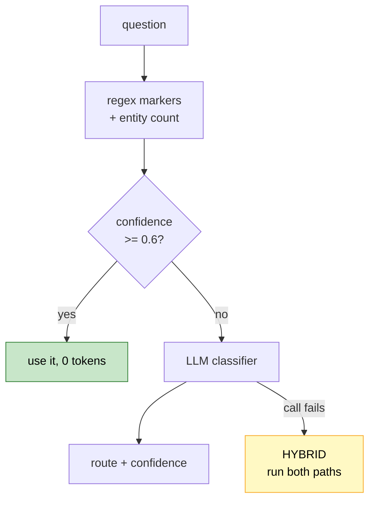
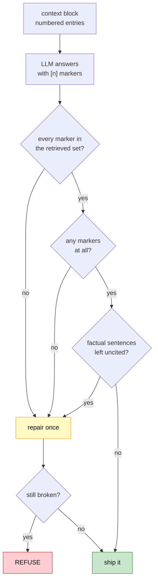

# Lesson 11. Routing, fusion, and refusing to answer

Two retrieval paths work. This lesson decides which to use, merges them when
both run, and then does the thing that makes the whole project trustworthy:
checks every citation and refuses when a claim has nothing behind it.

---

## Routing: heuristic first, model second



The heuristic is two lists of regexes and a count of linked entities.

```text
  graph markers    connected, related, between, both, partners,
                   competitor, invested, acquired, supplies,
                   how many, list all, board, supply chain
  vector markers   what is, define, describe, explain, known for,
                   mission, history, focused on
```

The strongest single signal is not a word at all. **Two named entities in one
question is a connection question**, near enough always, and that rule alone
resolves most of the interesting cases:

```python
if len(entities) >= 2:
    return Route.GRAPH, 0.85 if graph_hits else 0.7
```

Measured on seven questions, all sub-millisecond and zero tokens:

```text
  route    conf  llm      question
  ──────   ────  ───      ────────────────────────────────────────
  vector   0.75  n        What is Anthropic focused on?
  graph    0.85  n        How many companies compete with NVIDIA?
  hybrid   0.70  n        Describe Tesla and list its partners.
  vector   0.75  n        What is the capital of France?
```

Heuristics before models is a habit worth keeping. Not because regexes are
elegant, but because a routing decision that costs a model call doubles your
latency and your token bill for something a word list gets right most of the
time. The classifier earns its place only on the questions the rules cannot
call.

**A classifier outage must not take retrieval down.** If the model call throws,
the fallback is `HYBRID`, which runs both paths and costs more rather than
failing:

```python
except Exception:
    return Route.HYBRID, 0.5, False
```

Every decision lands in `routing_decisions` with the question, route,
confidence, whether it fell back, hit count, and latency. The spec is blunt
that you will not be able to reconstruct this later, and it is right.

---

## Fusion: rank position, not score

Vector search returns cosine similarity around 0.7. Graph traversal returns a
coverage score around 20. Those numbers share no scale, and any attempt to
normalise them invents a weighting you cannot justify.

Reciprocal Rank Fusion sidesteps it by throwing the scores away and using only
position:

```python
scores[key] = scores.get(key, 0.0) + 1.0 / (k + rank)
```

```text
  rank   contribution (k=60)
  ────   ───────────────────
     1   0.0164
     2   0.0161
     3   0.0159
    10   0.0143
```

`k=60` is from the original paper and is not tuned here. Its job is to flatten
the top-rank advantage so a single list cannot dominate: rank 1 is worth only
slightly more than rank 3, which means agreement between the two sources
matters more than either source's own confidence.

A chunk both paths surfaced beats a chunk only one did. That is the entire
mechanism, and it needs no calibration.

One asymmetry worth noting. Facts are ranked by their best chunk's fused score
but never dropped for scoring zero, because a graph fact whose chunks the vector
path missed entirely is often exactly the multi-hop answer. Dropping it would
throw away the thing the graph is for.

---

## Citations, and refusing



The context block labels its two sources separately, because the model needs to
know which claims came from a traversal and which from a passage:

```text
  FACTS FROM THE KNOWLEDGE GRAPH

  [1] Microsoft has invested in OpenAI.
  [2] Microsoft partners with OpenAI.

  PASSAGES FROM THE DOCUMENTS

  [3] (microsoft.txt) In 2019 and 2023, Microsoft invested a total of ...
```

Each `[n]` maps to a list of `chunk_id`s, so a marker is checkable rather than
decorative.

### Three failures, one cause

```text
  failure                     detection
  ─────────────────────────   ─────────────────────────────────
  cites [7] when only 1-5     marker not in the retrieved set
    were retrieved
  no citations at all         empty marker list
  factual sentence uncited    sentence over 25 chars, no [n]
```

All three are the same underlying problem: a claim nothing backs. So they share
one handler:

```python
def describe_problem(result: ValidatedAnswer) -> str | None:
    if result.invalid_markers:
        return "it cited ... which were never retrieved"
    if not result.citations:
        return "it contained no citations at all"
    if result.uncited_sentences:
        return "... factual sentence(s) had no citation"
    return None
```

I originally only handled the first. The measured result was an answer that was
correct, sourced in spirit, and carried zero markers:

```text
  ANSWER: Microsoft has invested in OpenAI.
          Microsoft partners with OpenAI.
          These relationships link Microsoft closely to OpenAI.
  cites=[] chunks=0
```

Nothing in that is false. It is also unverifiable, and a citation validator
that only checks the citations that exist will pass every uncited answer it
ever sees. **Detecting a problem and not acting on it is the same as not
detecting it**, and my `uncited_sentences` field sat populated and ignored.

Two fixes. The prompt got a worked example, because telling a model to cite is
weaker than showing it:

```text
  Context:
  [1] Jensen Huang is the CEO of NVIDIA.
  [2] NVIDIA develops the H100.
  Question: Who leads NVIDIA and what do they make?
  Answer: Jensen Huang is NVIDIA's chief executive [1]. The company
  develops the H100 [2].
```

And the repair path now triggers on all three failures. One retry, then refuse.

### Refusing is a feature

```text
  Q: What is the capital of France?
  ANSWER: I could not find enough information in the indexed documents
          to answer that.
  refused=True
```

The model knows the answer perfectly well. The prompt forbids outside
knowledge, so it declines, which is correct: an answer this system cannot cite
is an answer it has no business giving. The benchmark has eight out-of-scope
questions scored on whether the system refuses, so refusal is measured rather
than hoped for.

A working answer, for contrast:

```text
  Q: Who is the CEO of OpenAI?
  route=hybrid entries=10
  ANSWER: The CEO of OpenAI is Sam Altman. [1]
  refused=False repaired=False invalid=[] cites=[1] chunks=1
```

One citation, resolving to one real chunk, no repair needed.

---

## Verify

**Routing costs nothing on the easy cases.**

```bash
python -m app.retrieval.router
```

Sub-millisecond, `llm=n` on every row where the markers fire.

**Fusion prefers agreement.** Run a hybrid question and check that a chunk
appearing in both the passage list and a fact's `chunk_ids` sorts above one
appearing in only the passage list.

**An out-of-scope question refuses.** If "What is the capital of France?"
answers, the prompt's outside-knowledge rule is not holding and every accuracy
number downstream is inflated.

**A phantom citation is caught.** The direct test, no model needed:

```bash
python -c "
from app.generation.citations import validate, describe_problem
from app.generation.context import BuiltContext, ContextEntry
ctx = BuiltContext(entries=[ContextEntry(marker=1, kind='graph', chunk_ids=['abc'], text='x')])
for answer in ['Fact [1].', 'Fact [7].', 'Fact with no marker at all here.']:
    r = validate(answer, ctx)
    print(f'{answer!r:42} -> {describe_problem(r)}')
"
```

Expect `None` for the first, an invalid-marker complaint for the second, and a
no-citations complaint for the third.

---

## Then Lesson 12

The answer path works. Lesson 12 is delivery: the provider gateway that made
this survivable when Groq's daily quota ran out mid-session, the HTTP surface,
per-stage timings, and the React frontend that turns `[1]` into a click showing
the source text.
