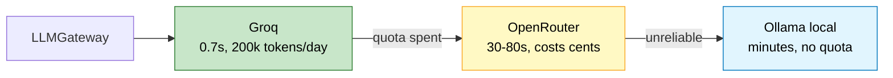
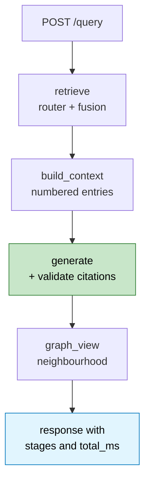

# Lesson 12. Delivery: gateway, API, timings, and a UI

The retrieval and answer logic works. This lesson makes it reachable, and adds
the provider gateway that saved the project when a quota ran out mid-session.

---

## The gateway, and why it waited until now

`app/llm/base.py` stayed empty through five lessons. That was deliberate, and
worth defending because the opposite instinct is strong.

```text
  what an interface buys you            when we had one provider
  ────────────────────────────────      ────────────────────────
  swap implementations at runtime       nothing to swap
  test with a fake                      no test needed one
  force a shared shape on N providers   N = 1
```

An abstract base class with a single implementation is a file, an import, and a
jump every time you read the code, in exchange for nothing. Worse, an interface
designed against one provider is usually the wrong shape when the second
arrives, so you rewrite it with less information than you would have had by
waiting.

It became real when three providers existed:



Ordered fastest, then most reliable, then unlimited.

`Protocol` rather than `ABC`, because neither client inherits from anything:

```python
@runtime_checkable
class LLMClient(Protocol):
    model: str
    def complete_text(self, prompt: str, temperature: float = 0.0) -> str: ...
    def complete_json(self, prompt: str) -> dict: ...
```

Structural typing checks the shape without forcing a base class onto code that
already worked. Both clients satisfy it without knowing it exists:

```text
  GroqClient           isinstance(LLMClient) = True
  OpenRouterClient     isinstance(LLMClient) = True
```

**The local provider is opt-in.** `include_local=True` is right for an
unattended bulk job and wrong on a request path, where it would turn a 2 second
query into a 3 minute one. A fallback that is worse than failing is not a
fallback.

### It fired for real

Groq's 200,000 tokens-per-day cap ran out mid-session. The gateway failed over
without intervention:

```text
  ANSWER: The CEO of OpenAI is Sam Altman. [1]
  provider: OpenRouterClient  failovers: 2
```

A fallback that has actually fired once is worth more than one that has only
been designed. This one also justified itself twice over: it is what let
extraction continue on OpenRouter and then locally when both hosted options ran
dry.

---

## The API

```text
  POST /query                 question in, cited answer out
  GET  /chunks/{chunk_id}     resolve a citation to its text
  GET  /graph/neighbourhood   nodes and edges for the UI
  GET  /stats                 row and node counts
  POST /ingest                run the pipeline
  GET  /health                per-dependency status
```

`/query` is the orchestrator and nothing else does any thinking:



`GET /chunks/{chunk_id}` is small and does the work that makes citations mean
something. A `[1]` the reader cannot open is a claim of provenance, not
provenance. The frontend turns every marker into a button that hits this.

CORS is scoped to the Vite dev server:

```python
allow_origins=["http://localhost:5173", "http://127.0.0.1:5173"]
```

A wildcard here would be the lazy choice that a reviewer notices.

The clients are module-level singletons behind getters, so the first request
pays for constructing the embedding client and the Neo4j driver rather than
every request paying it.

---

## Timings, not a total

A query touches the router, the embedder, Postgres, Neo4j, and an LLM. "That
took 4 seconds" tells you nothing useful.

```python
with trace.stage("retrieve"):
    ...
with trace.stage("build_context"):
    ...
with trace.stage("generate"):
    ...
```

```json
{"level": "INFO", "message": "query",
 "trace_id": "0c3e3233d33a42f38dcc96baec0fcc38", "total_ms": 81.57,
 "stages": {"route": 10.29, "vector_search": 50.63, "generate": 20.48},
 "route": "hybrid", "chunks": 7}
```

One trace id per query, one line, JSON so it can be queried. The interesting
property is `slowest()`: with per-stage numbers you know whether to optimise
the embedding call, the Cypher, or the prompt. Without them you guess, and the
measured answer is usually generation by an order of magnitude, which means
optimising the SQL would have been wasted work.

The same numbers go to the UI rather than only to a log, because a latency
budget nobody sees is a latency budget nobody defends.

---

## The frontend

Vite, React, TypeScript, and exactly one runtime dependency for the graph.

```text
  frontend/src/
    api.ts                  typed client, one fetch wrapper
    App.tsx                 question box, answer, panels
    components/GraphView.tsx force-directed neighbourhood
    App.css                 tokens and layout, no component library
```

Three things it does that a plain chat box does not.

**Citations are clickable.** The answer text is split on `[\d+]`, each marker
becomes a button, and clicking fetches the chunk and shows the real text.

```tsx
const parts = answer.split(/(\[\d+\])/g);
```

Markers are colour-coded by source, blue for a graph fact and green for a
passage, so you can see at a glance whether an answer came from traversal or
similarity.

**The routing decision is visible.** Route, confidence, per-stage timings, and
a badge when citations had to be repaired. Most RAG demos hide this. Showing it
is the difference between a demo and something you can debug.

**The graph is drawn.** `react-force-graph-2d` renders the entity
neighbourhood behind the answer, with the question's linked entities drawn
larger and outlined.

One real bug worth recording: `react-force-graph` mutates the objects it is
handed, adding `x`, `y`, and velocity fields. Passing React state straight in
corrupts it. The fix is copies:

```tsx
const data = useMemo(() => ({
  nodes: nodes.map((n) => ({ ...n })),
  links: edges.filter(...).map((e) => ({ ...e })),
}), [nodes, edges]);
```

Also note the `edges.filter` guarding that both endpoints exist. The library
throws on an edge pointing at a missing node, which happens whenever the
neighbourhood query is truncated.

---

## Verify

**Every module imports.** Cheap, and it catches a circular import or a typo in
a name before you chase it through a request.

```bash
python -c "
import importlib
for m in ['app.main','app.api.routes','app.llm.base','app.retrieval.hybrid',
          'app.generation.citations','app.evaluation.benchmark']:
    importlib.import_module(m); print('OK', m)
"
```

**The gateway lists what is configured.**

```bash
python -m app.llm.base
```

```text
  providers: ['GroqClient', 'OpenRouterClient']
  text     : OK
  served by: GroqClient
```

**Health reports per dependency.**

```bash
curl -s localhost:8000/health
```

`{"status":"ok","postgres":true,"neo4j":true}`. Two booleans, not one, so a
failure points at a container instead of at the app.

**A citation resolves.** Take a `chunk_id` from a `/query` response and fetch
it. If that 404s, the answer is citing something that does not exist and the
validator has a hole.

**The frontend builds.**

```bash
cd frontend && npx tsc --noEmit && npm run build
```

Clean typecheck, roughly 384 kB bundled, 123 kB gzipped. Most of that is the
graph library, which is the honest cost of the graph view.

---

## Then Lesson 13

Everything works. Lesson 13 measures it: 60 questions stratified by hop count,
hybrid against a vector-only baseline, and the table that either supports this
architecture or does not.

That lesson also contains the most useful bug in the project, because the first
benchmark run said hybrid was **worse** than vector on every category, and the
reason turned out to be a design mistake rather than a measurement error.
