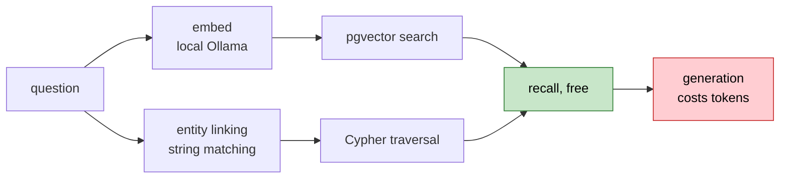

# Lesson 13. The benchmark, and the bug it caught

Everything works. This lesson asks whether it was worth building, which is a
different question and the only one that matters for a portfolio piece.

The honest answer needs a number, and the first number said the graph made
things worse.

---

## What to measure

The spec is specific: 50 to 100 questions stratified by difficulty, hybrid
against a vector-only baseline, accuracy broken out by hop count. The expected
shape is stated in advance.

```text
  single hop     parity, both systems should get it
  two hop        gap opens
  three hop      gap widens
  aggregation    graph should win, it can count edges
  out of scope   both should refuse
```

Predicting the shape before measuring is the point. A benchmark you design
after seeing the results is a benchmark you have fitted.

60 questions, in `data/benchmark/questions.json`:

```text
  single_hop     20
  two_hop        15
  three_hop       8
  aggregation     9
  out_of_scope    8
```

### Gold labels name documents, not chunks

```json
{
  "id": "3h-01",
  "question": "Who leads the company that owns the cloud platform OpenAI trains on?",
  "category": "three_hop",
  "gold_documents": ["openai.txt", "microsoft.txt", "microsoft_azure.txt", "satya_nadella.txt"],
  "gold_entities": ["OpenAI", "Microsoft Azure", "Microsoft", "Satya Nadella"],
  "answer_contains": ["Nadella"],
  "answerable": true
}
```

Labelling chunk ids would have been more precise and would have expired the
first time chunk boundaries moved. Chunk ids are content hashes, so changing
`max_characters` invalidates every one of them. Document filenames survive
re-chunking, re-embedding, and re-extraction, and a human can read them and
tell whether the label is right.

### The set is model-authored, and the README says so

I wrote these questions from the corpus. That is weaker evidence than human
labelling, in a specific way worth naming: the questions were written by
something that had already seen how the retrieval works, so they may be
unintentionally shaped to what the system does well.

The mitigation is not a disclaimer, it is that the file is committed, readable,
and correctable. Anyone can open it and change a gold label they disagree with.

---

## Retrieval recall needs no API tokens

This realisation salvaged the lesson. Groq's daily quota was spent, so a full
run with generation was impossible. But look at what each metric actually costs:



Embeddings are local. Entity linking is string matching against the graph, by
the design decision in Lesson 10. Postgres and Neo4j are local. **Only the
final generation step touches a paid API.**

So `--retrieval-only` measures recall and latency for nothing:

```bash
python -m app.evaluation.benchmark --retrieval-only
```

That is a general habit worth keeping. Separate the metrics by what they cost,
and you can keep measuring the cheap ones when the expensive path is
unavailable. A single monolithic eval that always needs the LLM would have left
me with no numbers at all.

---

## The first run: hybrid lost, everywhere

```text
  | category    | vector | hybrid | delta |
  | single_hop  |  0.95  |  0.90  | -0.05 |
  | two_hop     |  0.82  |  0.48  | -0.34 |
  | three_hop   |  0.52  |  0.30  | -0.22 |
  | aggregation |  0.82  |  0.45  | -0.37 |
  | all         |  0.85  |  0.66  | -0.19 |
```

Worse on every answerable category, and worst exactly where the graph was
supposed to help.

The tempting explanations were both wrong. It was not the incomplete graph, and
it was not the resolution threshold. One instrumentation query found it:

```text
  route chosen by the router: {'hybrid': 27, 'vector': 10, 'graph': 23}

  passages returned per route:
    vector   passages=5  facts=0
    graph    passages=0  facts=5     <- here
    hybrid   passages=5  facts=5
```

**23 of 60 questions routed to graph-only and received zero passages.** Recall
on those was measuring graph coverage alone, on a graph built from a third of
the corpus.

My code read:

```python
if route in (Route.VECTOR, Route.HYBRID):
    passages = self.store.search(question, limit=limit)
```

That treats the router's decision as choosing *which source to use*. It should
choose *what to add*. A traversal is a supplement to the passage set, never a
replacement, because passages are the safety net for exactly the case where the
graph is sparse or the linker missed.

```python
# Passages are always fetched. Measured: routing to graph-only and
# returning no passages dropped document recall from 0.85 to 0.66.
passages: list[SearchHit] = self.store.search(question, limit=limit)

if route in (Route.GRAPH, Route.HYBRID):
    facts = self.graph.retrieve(question, limit=limit * 3)
```

The fix removed a branch and a special-case fallback. It is less code than what
it replaced, which is usually the sign of a real fix rather than a patch.

Cost of the safety net: one embedding and one indexed query, about 270 ms.

---

## The second run

```text
  | category    | n  | vector | hybrid | delta |
  | single_hop  | 20 |  0.95  |  0.95  | +0.00 |
  | two_hop     | 15 |  0.82  |  0.87  | +0.05 |
  | three_hop   |  8 |  0.52  |  0.59  | +0.07 |
  | aggregation |  9 |  0.82  |  0.82  | +0.00 |
  | out_of_scope|  8 |  1.00  |  1.00  | +0.00 |
  | all         | 60 |  0.85  |  0.87  | +0.02 |

  latency        median    p95
  vector         310 ms    529 ms
  hybrid         324 ms    583 ms
```

Parity at one hop. Gap opens at two. Widens at three. That is the predicted
shape, and hybrid costs 5% more latency to get it.

### What I would not claim

The deltas are `+0.05` on 15 questions and `+0.07` on 8. That is a handful of
documents, comfortably inside noise for a set this size. Anyone reading this
table who is impressed by the magnitude is reading it wrong.

What survives scrutiny is the **direction, and that it is consistent across
both multi-hop categories while being flat on single-hop.** A random effect
would not line up with the prediction that neatly. It is weak evidence for the
right conclusion, which is worth more than strong evidence for a conclusion you
fitted afterwards.

Aggregation coming out flat is a genuine miss. Counting edges is what a graph
should be best at, and it is not winning. Two candidate reasons: the graph is
incomplete, and `COUNT_BY_RELATION` exists as a template but the router has no
rule that selects it. That is a real lead, not a mystery.

---

## Verify

**Reproduce the table.**

```bash
python -m app.evaluation.benchmark --retrieval-only --out ../docs/benchmark_retrieval.json
```

**Check the route distribution when a number surprises you.** The counts per
route are the first thing to look at, because a retrieval metric that moves
without a retrieval change is usually routing.

**Out-of-scope must stay at 1.00.** Those eight questions score on whether the
system refuses. If that column drops, the prompt's outside-knowledge rule has
stopped holding and every accuracy figure above it is inflated.

**Re-run after extraction completes.** These numbers come from 65 of 134
chunks. The hybrid column is the one that should move.

---

## What the whole project measured

Collected, because the numbers are the point:

```text
  batching embeddings           19% faster, not 10x, flat above batch 8
  nomic task prefixes           no benefit on this corpus, slightly worse
  HNSW index at 134 rows        2.56ms vs 2.57ms, no gain
  HNSW index at 50k rows        84x, and flat as the table grows
  ORDER BY similarity           250x slower, identical rows, silent
  reasoning_effort=low          733 vs 1956 tokens, 43% -> ~0% failures
  resolution threshold 0.84     precision 1.00, recall 0.80
  resolution threshold 0.82     precision 0.67, four false merges
  containment merge rule        merged three different people
  graph-only routing            recall 0.85 -> 0.66
  hybrid over vector, 3-hop     +0.07 recall, +5% latency
```

Six of those eleven contradicted what I expected before measuring. That ratio is
the argument for measuring.
