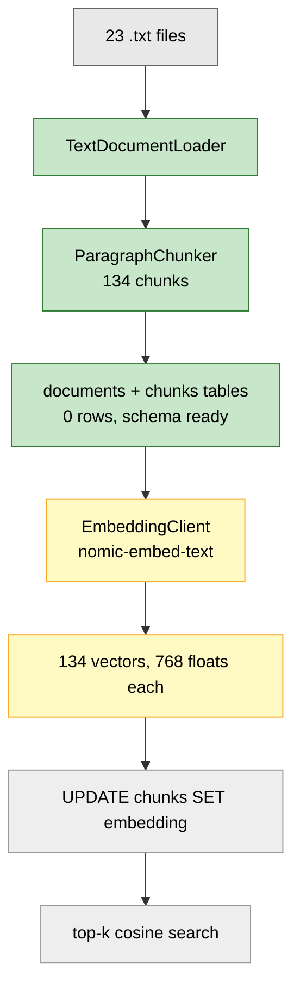
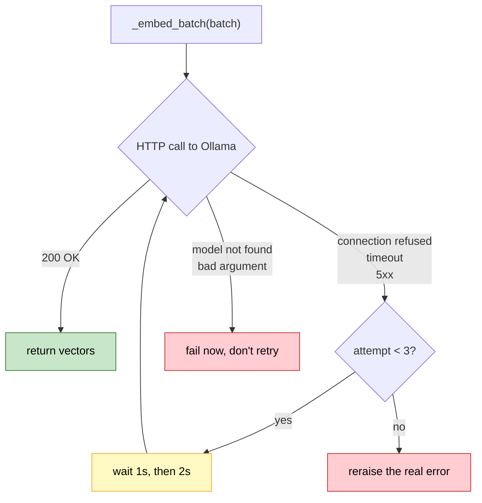
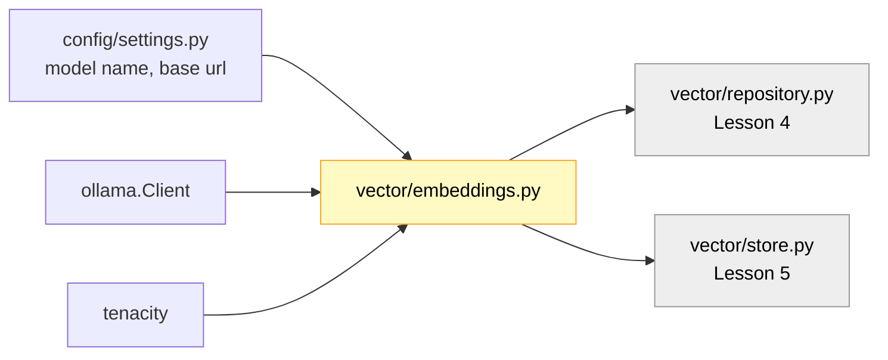
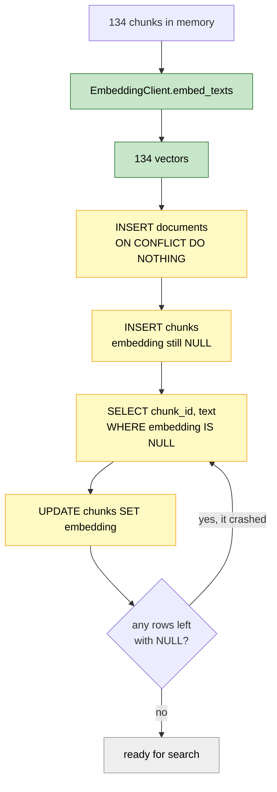

# Lesson 3. The embedding client

## Where we are



Green is done. Yellow is this lesson. Grey is Lessons 4 and 5.

This lesson builds the thing that turns text into numbers. No database writes
yet. I want the embedding step working and measured on its own, because it's
the one part of the pipeline that talks to a model over a network, and network
calls fail in ways that pure functions don't.

---

## What an embedding actually is

```text
  "Jensen Huang co-founded NVIDIA in 1993 and serves
   as its president and chief executive officer."
                    │
                    ▼
        ┌───────────────────────┐
        │   nomic-embed-text    │
        │   274 MB, local       │
        └───────────────────────┘
                    │
                    ▼
  [ 0.0213, -0.1144,  0.0871, ... ,  0.0402 ]
    └────────────── 768 floats ──────────────┘
```

One fixed-size list of numbers per piece of text. Length is always 768, whether
you feed it four words or eight hundred characters. That fixed width is what
makes the numbers comparable, and it's also why oversized chunks dilute, which
is the thing we fixed back in Lesson 1.

The numbers themselves mean nothing individually. Float 341 is not "how much
this text is about hardware." Only the *distances between* whole vectors carry
meaning.

### Why distance means anything

Here are real cosine similarities I measured on your corpus with your model:

```text
query:  "Who is the chief executive of NVIDIA?"

                                                    cosine
  "Jensen Huang co-founded NVIDIA in 1993 and       0.7784   ← close
   serves as its president and chief executive"

  "Tesla manufactures electric vehicles and         0.4485   ← far
   energy storage systems at its gigafactories"

                                          gap =    0.3299
```

Picture it in two dimensions instead of 768:

```text
                    ▲
                    │        ● "Jensen Huang co-founded NVIDIA..."
                    │       ╱
                    │      ╱  small angle → cosine near 1
                    │     ╱
                    │    ★ query: "Who is the CEO of NVIDIA?"
                    │     ╲
                    │      ╲
                    │       ╲  wide angle → cosine near 0
                    │        ╲
                    │         ● "Tesla manufactures electric vehicles..."
                    └──────────────────────────────────────────▶
```

Cosine measures the angle between two vectors and ignores their length. Two
texts pointing the same direction score near 1.0, unrelated texts score near
0.0. That gap of 0.33 is the entire basis of retrieval. Ranking works because
the gap exists.

Note the query never appeared in the corpus. Nothing matched on the word "CEO",
because the chunk says "chief executive officer". Keyword search would have
missed it. That is the whole reason we're doing this instead of `LIKE '%ceo%'`.

---

## The API, and the trap inside it

`ollama` 0.6.2 gives you two embedding calls. Use one, ignore the other.

```text
  client.embed(model=..., input=...)        ← use this
  client.embeddings(model=..., prompt=...)  ← deprecated, single text only
```

The docstring on `embeddings` literally reads "Deprecated in favor of `embed`."
Most tutorials you'll find online still use it, because it's older.

Now the trap. `embed` returns `EmbedResponse`, whose vector attribute is
**plural and always nested**, even for one input:

```text
  input = "one string"                 input = ["a", "b", "c"]
        │                                    │
        ▼                                    ▼
  response.embeddings                  response.embeddings
        │                                    │
        ▼                                    ▼
  [ [768 floats] ]                     [ [768], [768], [768] ]
    │                                    │
    └─ len == 1                          └─ len == 3
       a LIST holding one vector            a list holding three

  response.embeddings[0]  ← the actual vector, in both cases
  response.embeddings     ← a list of lists, never a flat vector
```

I verified this against your installed version. A single string in still gives
you `len(response.embeddings) == 1`, so you need the `[0]`.

Get this wrong and you don't get an exception. You get a list of one list where
you expected 768 floats, and it travels several functions before something
complains. When it finally does, the error points nowhere near the mistake. So
we're going to wrap it once and never write `.embeddings` at a call site again.

---

## Batching, and the speedup that mostly wasn't

`input` accepts a sequence, so we can send many texts per HTTP request. The
obvious question is how much that helps. I measured it on your 134 chunks:

```text
 batch │ HTTP  │  wall  │ chunks
  size │ calls │  time  │  /sec
 ──────┼───────┼────────┼────────
     1 │   134 │ 48.60s │  2.8
     8 │    17 │ 39.49s │  3.4     ← plateau starts here
    32 │     5 │ 39.19s │  3.4
    64 │     3 │ 39.48s │  3.4
```

I expected a much bigger win and did not get one. Batching saves 19% going
from 1 to 8, then flatlines completely. Nothing above 8 is faster.

That tells you where the time actually goes. Ollama isn't running the batch as
one parallel forward pass, it's looping internally. What batching saves is 134
HTTP round trips collapsed into 17, and that overhead is real but small next to
the model's own compute. The model is the bottleneck, not the transport.

Worth knowing, because it changes how you pick the number:

```text
larger batches                  smaller batches
──────────────                  ───────────────
fewer HTTP calls                a failed retry re-does less work
no faster above 8               batch=64 failing wastes 64 embeddings
                                batch=8  failing wastes 8
```

Since speed is flat from 8 upward, the only thing left to optimise is how much
work a retry throws away. I'm defaulting to 32 because five calls is tidy and
the retry waste is acceptable at this corpus size. If you ever see retries
firing often, drop it to 8 and you'll lose nothing. That's why it's a
constructor argument and not a hardcoded number.

Also note the absolute figure. 39 seconds for 134 chunks is 3.4 per second.
Scale that to 50,000 chunks and you're waiting four hours. This is the step
that will dominate your ingestion time forever, which is exactly why Lesson 4
makes it resumable.

---

## Retry, and what deserves one

Everything before this lesson was deterministic. Same input, same output, no
network. `embed` breaks that.



The distinction on the right matters more than the retry itself. Retrying a
transient failure is correct. Retrying a permanent one wastes ten seconds and
then reports the same error, except now you've hidden it behind a delay.

```text
retry these                          don't retry these
───────────                          ─────────────────
Ollama container restarting          model name is wrong
request timed out                    you passed a bad argument
connection refused                   the text is malformed
transient 5xx                        your API contract is wrong
```

So we scope the retry to specific exception types. `httpx.HTTPError` covers
timeouts and connection failures, since ollama uses httpx underneath, and
`ollama.ResponseError` covers server-side errors. I checked both names against
your installed packages.

The backoff schedule:

```text
attempt 1 ──✗──▶ wait 1s ──▶ attempt 2 ──✗──▶ wait 2s ──▶ attempt 3 ──✗──▶ raise
                                                                            │
                                        reraise=True means you see the      │
                                        original error, not tenacity's ─────┘
                                        RetryError wrapper
```

`reraise=True` is the setting people forget. Without it, tenacity swallows your
`ConnectionError` and hands you a `RetryError` instead, and your traceback stops
telling you what actually broke.

---

## Where this file sits



It depends on settings and two libraries. It knows nothing about Postgres,
nothing about chunks, nothing about documents. It converts strings to lists of
floats. That's the whole job, and keeping it that narrow is why Lesson 5 can
reuse it for queries without any changes.

---

## Step 1. Write the client

Open the empty stub:

```text
backend/app/vector/embeddings.py
```

```python
import httpx
import ollama

from tenacity import (
    retry,
    retry_if_exception_type,
    stop_after_attempt,
    wait_exponential,
)

from app.config.settings import settings


class EmbeddingClient:

    def __init__(
        self,
        model: str | None = None,
        base_url: str | None = None,
        batch_size: int = 32,
        timeout: float = 60.0,
    ):
        self.model = model or settings.ollama_embedding_model
        self.batch_size = batch_size

        self.client = ollama.Client(
            host=base_url or settings.ollama_base_url,
            timeout=timeout,
        )

    def embed_texts(
        self,
        texts: list[str],
    ) -> list[list[float]]:

        if not texts:
            return []

        vectors: list[list[float]] = []

        for start in range(0, len(texts), self.batch_size):

            batch = texts[start:start + self.batch_size]

            vectors.extend(self._embed_batch(batch))

        if len(vectors) != len(texts):
            raise RuntimeError(
                f"embedding count mismatch: "
                f"sent {len(texts)}, got {len(vectors)}"
            )

        return vectors

    def embed_query(self, text: str) -> list[float]:
        return self.embed_texts([text])[0]

    @retry(
        stop=stop_after_attempt(3),
        wait=wait_exponential(multiplier=1, min=1, max=10),
        retry=retry_if_exception_type(
            (httpx.HTTPError, ollama.ResponseError)
        ),
        reraise=True,
    )
    def _embed_batch(
        self,
        batch: list[str],
    ) -> list[list[float]]:

        response = self.client.embed(
            model=self.model,
            input=batch,
        )

        return [
            list(vector)
            for vector in response.embeddings
        ]


if __name__ == "__main__":

    client = EmbeddingClient()

    vectors = client.embed_texts(
        [
            "NVIDIA designs graphics processing units.",
            "Anthropic is an AI safety company.",
        ]
    )

    print(f"texts embedded : {len(vectors)}")
    print(f"dimensions     : {len(vectors[0])}")
    print(f"first 5 floats : {vectors[0][:5]}")

    single = client.embed_query("Who runs NVIDIA?")

    print(f"embed_query    : {len(single)} floats, flat")
```

### Details worth pausing on

**The count check is the only validation here, and it earns its place.** You
might expect me to also assert that every vector is 768 long. I'm not going to,
because Lesson 2 already put that guarantee in the database. The `vector(768)`
column rejects a wrong-length insert with a clear error. Duplicating that check
in Python buys nothing.

The count check is different. If Ollama ever returns 31 vectors for 32 texts,
no database constraint catches it. What happens instead is that every vector
after the gap pairs with the wrong chunk, and the whole corpus is silently
misaligned. Retrieval still runs. It just returns the wrong text, forever, with
confident citations. That failure is invisible and unrecoverable without a full
re-embed, so it gets a guard.

This is the general rule I'd apply anywhere. Validate what nothing downstream
can catch. Skip what a constraint already enforces.

**`embed_query` exists to hold the `[0]`.** One line, and its only job is to
put the nesting trap in exactly one place. Lesson 5 calls it for every search
and never thinks about `.embeddings` again.

**`list(vector)` in the comprehension.** The declared return type is
`Sequence[Sequence[float]]`. Right now those inner sequences happen to be
lists, but relying on that is relying on an implementation detail rather than
the contract. The conversion costs nothing and makes the annotation honest.
pgvector will want real lists in Lesson 4 anyway.

**One method, not two.** No `embed_documents` and `embed_query` pair with
different behaviour. There's nothing to differentiate them yet, and Step 3
explains why.

**`timeout` goes in the constructor.** `ollama.Client` absorbs it through
`**kwargs` and hands it to httpx. There is no per-call timeout argument on
`embed`, so passing one there fails.

---

## Step 2. Run it

From `backend/`:

```bash
python -m app.vector.embeddings
```

Expected:

```text
texts embedded : 2
dimensions     : 768
first 5 floats : [0.0213, -0.1144, 0.0871, ...]
embed_query    : 768 floats, flat
```

Your float values will differ from mine in the last digits. The two numbers
that must match exactly are 768 and 2.

If you get `ConnectionError` or a timeout, Ollama isn't running. Check with
`ollama list`.

---

## Step 3. Settle the prefix question yourself

Here's something you'd hit on your own the first time you read the
`nomic-embed-text` model card. Nomic trained the model with task prefixes and
documents you index are supposed to start with `search_document: `, while
queries are supposed to start with `search_query: `.

Our client above uses neither. I want you to decide whether that's a mistake,
by measuring rather than by trusting either me or the model card.

Save this as `backend/prefix_test.py`. It's throwaway, so delete it afterwards.

```python
import math
from pathlib import Path

from app.ingestion.pipeline import IngestionPipeline
from app.vector.embeddings import EmbeddingClient


QUESTIONS = [
    ("Who is the chief executive of NVIDIA?", "nvidia.txt"),
    ("What does Anthropic build?", "anthropic.txt"),
    ("When was Amazon Web Services launched?", "amazon_web_services.txt"),
    ("Who leads Microsoft?", "microsoft.txt"),
    ("What is ChatGPT?", "chatgpt.txt"),
    ("Who founded Tesla?", "tesla_inc.txt"),
    ("What is Sundar Pichai known for?", "sundar_pichai.txt"),
    ("What company did Jeff Bezos start?", "jeff_bezos.txt"),
]


def cosine(a, b):
    dot = sum(x * y for x, y in zip(a, b))
    na = math.sqrt(sum(x * x for x in a))
    nb = math.sqrt(sum(y * y for y in b))
    return dot / (na * nb)


def evaluate(label, query_prefix, document_prefix):

    client = EmbeddingClient()

    results = IngestionPipeline().process_directory(
        Path("../data/raw")
    )

    chunks = [
        (document.filename, chunk.text)
        for document, chunk_list in results
        for chunk in chunk_list
    ]

    document_vectors = client.embed_texts(
        [document_prefix + text for _, text in chunks]
    )

    query_vectors = client.embed_texts(
        [query_prefix + question for question, _ in QUESTIONS]
    )

    hits = 0
    margins = []

    for (question, gold), query_vector in zip(QUESTIONS, query_vectors):

        scored = sorted(
            (
                (cosine(query_vector, vector), filename)
                for vector, (filename, _) in zip(document_vectors, chunks)
            ),
            reverse=True,
        )

        if scored[0][1] == gold:
            hits += 1

        best_gold = max(s for s, f in scored if f == gold)
        best_other = max(s for s, f in scored if f != gold)

        margins.append(best_gold - best_other)

    print(
        f"{label:<12} top1={hits}/{len(QUESTIONS)}  "
        f"mean_margin={sum(margins) / len(margins):+.4f}"
    )


if __name__ == "__main__":
    evaluate("NO PREFIX", "", "")
    evaluate("WITH PREFIX", "search_query: ", "search_document: ")
```

Run it. It embeds all 134 chunks twice, so give it about two minutes.

```bash
python prefix_test.py
```

Two numbers come out per run. `top1` counts how often the correct document's
chunk ranks first out of all 134. `mean_margin` is the average gap between the
best correct chunk and the best wrong one, which tells you how *confidently*
it ranked, not just whether it got there.

What I measured:

```text
              top1     mean_margin
NO PREFIX      7/8       +0.0740
WITH PREFIX    7/8       +0.0709
```

Identical accuracy. The prefixes made confidence very slightly worse. So we
skip them, and the code stays simpler for a measured reason rather than a
guessed one.

Two honest caveats. Eight questions is a small sample, and 134 clean
encyclopedic chunks is an easy corpus. Prefixes plausibly earn their keep on
mixed content at real scale. We'll be able to settle it properly in Arc E when
Recall@K exists, and reversing the decision is a two-line change.

Now the part that actually matters. Look at the shape of the experiment, not
the result:

```text
  prefixed documents  +  prefixed queries     →  works
  bare documents      +  bare queries         →  works
  prefixed documents  +  bare queries         →  quietly degraded
  bare documents      +  prefixed queries     →  quietly degraded
```

Both consistent choices are fine. Mixing them is the real bug, and it produces
no error at all, just worse rankings you'd probably blame on chunk size. If you
ever add prefixes, add them on both sides in the same commit.

Delete `prefix_test.py` when you're done.

```powershell
Remove-Item prefix_test.py
```

---

## Verify

Four checks, in order.

**1. Dimensions are 768.** Already covered by Step 2. If you see any other
number, the `vector(768)` column from Lesson 2 will reject every insert in
Lesson 4.

**2. Embeddings are deterministic.** Same text in, same vector out.

```bash
python -c "
from app.vector.embeddings import EmbeddingClient
c = EmbeddingClient()
a = c.embed_query('NVIDIA designs GPUs.')
b = c.embed_query('NVIDIA designs GPUs.')
print('identical:', a == b)
"
```

Expect `identical: True`. If it's False, the model is sampling and caching
embeddings becomes pointless.

**3. Batching preserves order.** This is the misalignment failure from earlier,
tested directly.

```bash
python -c "
from app.vector.embeddings import EmbeddingClient
c = EmbeddingClient(batch_size=2)
texts = ['alpha', 'beta', 'gamma', 'delta', 'epsilon']
batched = c.embed_texts(texts)
one_at_a_time = [c.embed_query(t) for t in texts]
print('count ok :', len(batched) == 5)
print('order ok :', batched == one_at_a_time)
"
```

Both must be True. `batch_size=2` on 5 texts forces three batches with an
uneven last one, which is exactly where an off-by-one in the slicing would
show up. `order ok: False` means `vectors.extend` is running out of sequence
and every chunk would pair with the wrong text.

**4. The retry fires on a real failure.** Stop Ollama, then call it.

```powershell
Stop-Service -Name ollama
python -c "
import time
from app.vector.embeddings import EmbeddingClient
t = time.perf_counter()
try:
    EmbeddingClient().embed_query('this should fail')
except Exception as error:
    print(f'{type(error).__name__} after {time.perf_counter() - t:.1f}s')
"
Start-Service -Name ollama
```

You want roughly 3 seconds of elapsed time, which is the 1s and 2s backoff, and
a real connection error type rather than `RetryError`. An instant failure means
your exception types don't match what httpx raised. `RetryError` means
`reraise=True` is missing.

If Ollama runs as a desktop app rather than a service on your machine, quit it
from the tray instead and skip the `Start-Service` line.

---

## Then say "next"



Lesson 4 writes rows. The loop back from that diamond is the resumability we
designed the nullable column for in Lesson 2, and at 3.4 chunks per second
you'll be glad it's there.

You'll also meet `register_vector`, which is what lets psycopg send a Python
list into a `vector(768)` column without hand-formatting it into a string.
