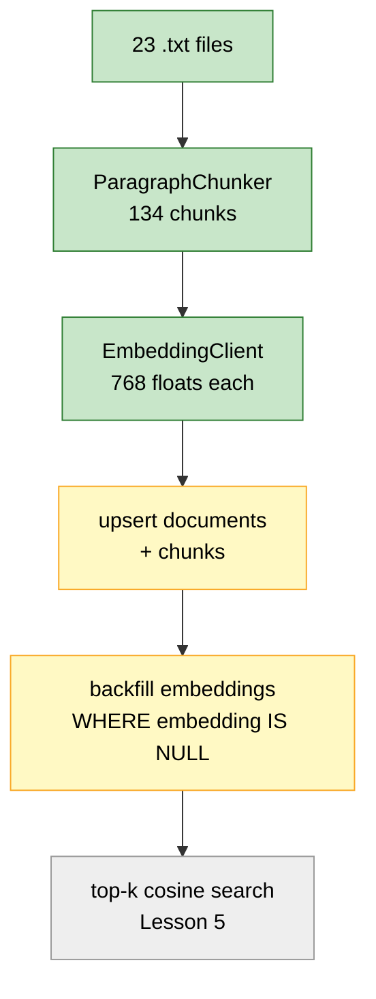
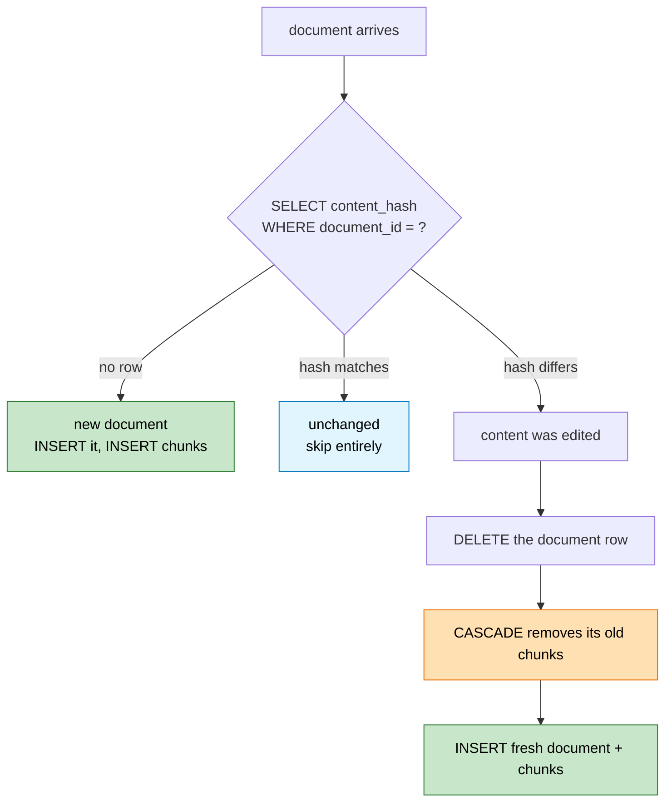
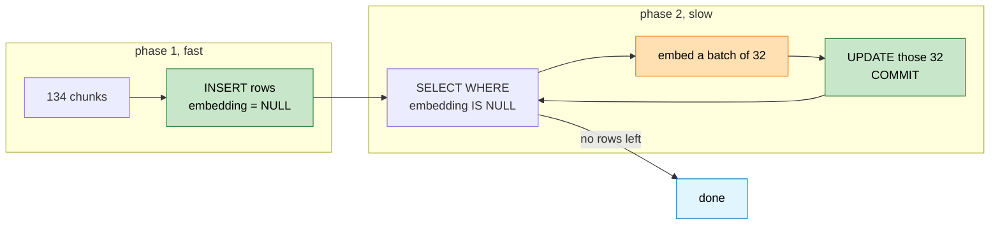
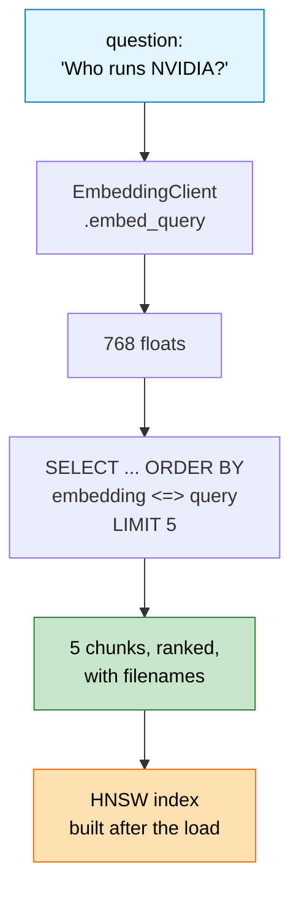

# Lesson 4. Writing rows, and resuming when it breaks

## Where we are



I checked your `EmbeddingClient` before writing this. Order survives batching,
768 dimensions, `embed_query` returns a flat list. It works.

Your tables are still empty. By the end of this lesson they hold 134 rows with
134 vectors, and re-running the whole thing changes nothing.

---

## First, a trap I want you to see before you hit it

There are four plausible ways to get a Python list of floats into a
`vector(768)` column. I tested all four against your database. Here is what
actually happens:

```text
                              without              with
                          register_vector    register_vector
 ───────────────────────  ───────────────    ───────────────
 bare list  INSERT              works             fails
 bare list  <=> search          FAILS             FAILS
 ───────────────────────  ───────────────    ───────────────
 string + CAST AS vector        works             works
 string + CAST <=> search       works             works
 ───────────────────────  ───────────────    ───────────────
 pgvector.Vector(list)          fails             works
```

Look at the first two rows together. Without `register_vector`, binding a bare
Python list inserts fine and stores the exact vector. I confirmed the
round-trip is bit-for-bit identical, zero delta. Then the search operator
refuses it:

```text
operator does not exist: vector <=> double precision[]
```

Postgres has an assignment cast from `float8[]` to `vector`, which is why the
INSERT works. Operator resolution doesn't use it, which is why `<=>` doesn't.

So here's the failure you'd walk into:

```text
  Lesson 4          you write 134 rows           everything looks perfect
     │              no errors, exact values      you move on
     ▼
  Lesson 5          first search query           UndefinedFunction
     │                                           on an operator you
     ▼                                           didn't think was involved
  30 minutes        suspect the query, the index, the embedding client,
  of debugging      the extension, anything except the INSERT you wrote
                    yesterday and watched succeed
```

That gap between where the bug lives and where it surfaces is what makes it
expensive. So we pick the approach that works in both columns of the table and
needs no setup at all.

### The choice

**String plus an explicit cast.** No `register_vector`, no SQLAlchemy event
listener, no `pgvector` import anywhere in our code.

```python
"[" + ",".join(repr(value) for value in vector) + "]"
```

then `CAST(:embedding AS vector)` in the SQL.

Two objections worth answering. Manual serialisation feels hacky, and `repr`
on a float feels lossy. Neither holds up. `repr` gives Python's shortest
round-trip representation, so it's exact, and I measured it: max absolute delta
across all 768 floats was `0.0`. As for hacky, the alternative is an event
listener mutating every connection in the pool plus a wrapper class, to achieve
the same result. The cast is visible in the SQL, which I prefer to magic
happening at connection time.

If you later switch to numpy arrays or want `SELECT embedding` to return
something other than a string, `register_vector` starts earning its keep. Today
it doesn't.

---

## The same problem with JSONB

Our `metadata` columns are JSONB, and our dataclasses carry `dict`. psycopg3
will not adapt a dict:

```text
  connection.execute(sql, {"metadata": {"filename": "x.txt"}})
                                        │
                                        ▼
        psycopg.ProgrammingError: cannot adapt type 'dict'
                                  using placeholder '%s'
```

Same shape of fix, same reason:

```text
  json.dumps(metadata)  →  CAST(:metadata AS jsonb)
```

Two columns, two explicit casts. There's a pattern here worth naming. psycopg
adapts the types Postgres has natively. Anything the extension added, or
anything structural like JSONB, you hand over as text and cast. Once you see
it that way it stops feeling like a special case.

---

## Content changes, and the column we haven't used yet

Back in Lesson 1 the loader computed a `content_hash` for every document, and
we've never read it. Now it earns its place.

Consider what `ON CONFLICT DO NOTHING` alone would do:

```text
  day 1   microsoft.txt  →  document_id abc123  →  2 chunks stored
  day 2   you rewrite microsoft.txt, tripling its length
  day 3   re-run ingestion

          document_id is sha256("local:microsoft.txt")
          the filename didn't change, so the ID didn't change
                            │
                            ▼
          ON CONFLICT DO NOTHING  →  keeps the day-1 content
                                     keeps the day-1 chunks
                                     your new text is never indexed
```

Silently stale. No error, no warning, and your searches keep returning the old
text. That's worse than a crash.

The hash makes the three cases distinguishable:



The delete-and-reinsert path is where the `ON DELETE CASCADE` from Lesson 2
pays off. Chunk IDs hash their own text, so edited content produces entirely
new chunk IDs. Without the cascade, the old chunks would linger forever as
orphans that still match queries and still cite a document whose content has
moved on. One `DELETE` on the parent clears them, because we declared the
relationship properly two lessons ago.

Three lessons in, and the pieces are starting to interlock. That's the payoff
for the deterministic IDs, the content hash, and the cascade, none of which did
anything visible when we wrote them.

---

## Two phases, and why the split is the whole design



I measured both phases on your 134 chunks:

```text
 phase                        time      share
 ─────────────────────────  ────────   ───────
 INSERT 134 rows              0.024s     0.06%
 UPDATE 134 embeddings        0.054s     0.14%
 embedding via Ollama        39.190s    99.80%
 ─────────────────────────  ────────   ───────
 total                      ~39.27s
```

The database work is noise. Ollama is everything. That single fact settles
several design questions at once.

Don't optimise the SQL. Saving half of 0.08 seconds is not a project. Do make
the slow phase resumable, because 39 seconds becomes four hours at 50,000
chunks, and losing that to a crash on the last batch would be genuinely
painful. And commit per batch rather than at the end, so a crash costs you one
batch of 32 instead of everything.

The loop in that diagram has a property I like. It doesn't track progress
anywhere. `WHERE embedding IS NULL` *is* the progress state, read fresh from
the database every pass. Kill the process at batch 40 of 134, restart it, and
it picks up at exactly the right place with no bookkeeping, no checkpoint file,
nothing to get out of sync. This is what the nullable column from Lesson 2 was
for.

---

## Transaction boundaries

```text
  ingest_corpus                     backfill_embeddings
  ─────────────                     ───────────────────
  ┌─ engine.begin() ────────┐       ┌─ engine.begin() ─┐
  │  doc 1  + its chunks    │       │  SELECT 32 nulls │
  │  doc 2  + its chunks    │       │  embed them      │
  │  ...                    │       │  UPDATE 32       │
  │  doc 23 + its chunks    │       └─ COMMIT ─────────┘
  └─ COMMIT ────────────────┘       ┌─ engine.begin() ─┐
                                    │  next 32         │
  all 23 or none                    └─ COMMIT ─────────┘
                                            ...
                                    one batch at a time
```

Different jobs, different boundaries. Ingestion is fast and atomic, so one
transaction for the lot. If it fails halfway you get an empty table rather than
a partial corpus, which is the state you want because a partial corpus looks
like a working one.

The backfill commits every batch on purpose, and it's the exception to the
all-or-nothing instinct. Holding one transaction open across four hours of
network calls would be a mistake: a single failure discards the entire run, and
you'd pin a database connection open the whole time for no reason.

---

## Step 1. Write the repository

Open the empty stub:

```text
backend/app/vector/repository.py
```

```python
import json
from pathlib import Path

from sqlalchemy import Connection, text

from app.domain.chunk import Chunk
from app.domain.document import Document
from app.infrastructure.postgres import engine
from app.ingestion.pipeline import IngestionPipeline
from app.vector.embeddings import EmbeddingClient


SELECT_CONTENT_HASH = """
SELECT content_hash
FROM documents
WHERE document_id = :document_id
"""


DELETE_DOCUMENT = """
DELETE FROM documents
WHERE document_id = :document_id
"""


INSERT_DOCUMENT = """
INSERT INTO documents (
    document_id,
    filename,
    source,
    title,
    content,
    content_hash,
    metadata
)
VALUES (
    :document_id,
    :filename,
    :source,
    :title,
    :content,
    :content_hash,
    CAST(:metadata AS jsonb)
)
"""


INSERT_CHUNK = """
INSERT INTO chunks (
    chunk_id,
    document_id,
    chunk_index,
    text,
    metadata
)
VALUES (
    :chunk_id,
    :document_id,
    :chunk_index,
    :text,
    CAST(:metadata AS jsonb)
)
ON CONFLICT (chunk_id) DO NOTHING
"""


SELECT_MISSING_EMBEDDINGS = """
SELECT chunk_id, text AS chunk_text
FROM chunks
WHERE embedding IS NULL
ORDER BY document_id, chunk_index
LIMIT :limit
"""


UPDATE_EMBEDDING = """
UPDATE chunks
SET embedding = CAST(:embedding AS vector)
WHERE chunk_id = :chunk_id
"""


def to_vector_literal(vector: list[float]) -> str:
    return "[" + ",".join(repr(value) for value in vector) + "]"


def upsert_document(
    connection: Connection,
    document: Document,
) -> bool:
    """Insert or replace a document. True if anything was written."""

    existing_hash = connection.execute(
        text(SELECT_CONTENT_HASH),
        {"document_id": document.document_id},
    ).scalar()

    if existing_hash == document.content_hash:
        return False

    if existing_hash is not None:
        # Content changed. Remove the old row and let
        # ON DELETE CASCADE clear its stale chunks.
        connection.execute(
            text(DELETE_DOCUMENT),
            {"document_id": document.document_id},
        )

    connection.execute(
        text(INSERT_DOCUMENT),
        {
            "document_id": document.document_id,
            "filename": document.filename,
            "source": document.source,
            "title": document.title,
            "content": document.content,
            "content_hash": document.content_hash,
            "metadata": json.dumps(document.metadata),
        },
    )

    return True


def insert_chunks(
    connection: Connection,
    chunks: list[Chunk],
) -> int:

    if not chunks:
        return 0

    connection.execute(
        text(INSERT_CHUNK),
        [
            {
                "chunk_id": chunk.chunk_id,
                "document_id": chunk.document_id,
                "chunk_index": chunk.chunk_index,
                "text": chunk.text,
                "metadata": json.dumps(chunk.metadata),
            }
            for chunk in chunks
        ],
    )

    return len(chunks)


def ingest_corpus(directory: Path) -> tuple[int, int, int]:
    """Returns (documents written, documents skipped, chunks written)."""

    results = IngestionPipeline().process_directory(directory)

    written = 0
    skipped = 0
    chunk_count = 0

    # ponytail: one transaction for the whole corpus. Fine at 23
    # documents. Move to per-document transactions if a single
    # bad file should not roll back the rest.
    with engine.begin() as connection:

        for document, chunks in results:

            if upsert_document(connection, document):
                chunk_count += insert_chunks(connection, chunks)
                written += 1
            else:
                skipped += 1

    return written, skipped, chunk_count


def backfill_embeddings(batch_size: int = 32) -> int:

    client = EmbeddingClient(batch_size=batch_size)

    total = 0

    while True:

        with engine.begin() as connection:

            rows = connection.execute(
                text(SELECT_MISSING_EMBEDDINGS),
                {"limit": batch_size},
            ).fetchall()

            if not rows:
                return total

            vectors = client.embed_texts(
                [row.chunk_text for row in rows]
            )

            connection.execute(
                text(UPDATE_EMBEDDING),
                [
                    {
                        "chunk_id": row.chunk_id,
                        "embedding": to_vector_literal(vector),
                    }
                    for row, vector in zip(rows, vectors)
                ],
            )

            total += len(rows)

            print(f"embedded {total} chunks")


if __name__ == "__main__":

    data_directory = Path(__file__).parents[3] / "data" / "raw"

    written, skipped, chunk_count = ingest_corpus(data_directory)

    print(f"documents written : {written}")
    print(f"documents skipped : {skipped}")
    print(f"chunks written    : {chunk_count}")

    embedded = backfill_embeddings()

    print(f"embeddings added  : {embedded}")
```

### Details worth pausing on

**`upsert_document` returns a bool, and the caller uses it.** Nothing writes
chunks for a document that didn't change. On a re-run that turns 134 chunk
inserts into 23 cheap hash comparisons. The return value is the whole
optimisation.

**Passing a list of dicts to `connection.execute`.** SQLAlchemy sees a list and
switches to executemany, so `insert_chunks` sends one statement for all of a
document's chunks rather than one per chunk. That's where the 0.024 seconds
comes from.

**`text AS chunk_text` in the SELECT.** Our column is called `text` and we
imported SQLAlchemy's `text()` function. They don't actually collide, since one
is a row attribute and the other a module-level name, but reading `row.text`
next to `text(SQL)` in the same function is needlessly confusing. The alias
costs nothing.

**The backfill returns from inside the loop.** `if not rows: return total` is
the exit. No sentinel, no `while True` with a break-and-flag, no separate count
query to decide whether to continue. The absence of rows is the condition.

**`parents[3]`.** From `backend/app/vector/repository.py`, three levels up is
the project root, so `data/raw` resolves whatever directory you run it from.
Count carefully if you moved the file.

---

## Step 2. Run it

From `backend/`:

```bash
python -m app.vector.repository
```

Expect a fast burst, then about 40 seconds of embedding:

```text
documents written : 23
documents skipped : 0
chunks written    : 134
embedded 32 chunks
embedded 64 chunks
embedded 96 chunks
embedded 128 chunks
embedded 134 chunks
embeddings added  : 134
```

The last batch is 6, not 32, which is why it prints 134 rather than 160.

---

## Verify

**1. The rows are there, and every one has a vector.**

```bash
docker exec -it rag-postgres psql -U rag -d rag -c "
SELECT
  (SELECT count(*) FROM documents) AS documents,
  (SELECT count(*) FROM chunks) AS chunks,
  (SELECT count(*) FROM chunks WHERE embedding IS NULL) AS missing;
"
```

```text
 documents | chunks | missing
-----------+--------+---------
        23 |    134 |       0
```

A non-zero `missing` means the backfill exited early. Just run the module
again, which is the resumability working rather than a workaround.

**2. Re-running writes nothing.** This is the real check for this lesson.

```bash
python -m app.vector.repository
```

```text
documents written : 0
documents skipped : 23
chunks written    : 0
embeddings added  : 0
```

All zeros and 23 skipped. Confirm the row counts from check 1 are unchanged.
Idempotent ingestion is what lets you re-run this in a cron job, a container
entrypoint, or twice by accident.

**3. Editing a file re-ingests exactly that file.** This exercises the hash
path and the cascade together.

```powershell
Add-Content ../data/raw/nvidia.txt "`nNVIDIA announced the Blackwell architecture in 2024."
python -m app.vector.repository
```

```text
documents written : 1
documents skipped : 22
chunks written    : 3
embeddings added  : 3
```

One document rewritten, its old chunks gone by cascade, three new chunks
embedded. Then check nothing leaked:

```bash
docker exec -it rag-postgres psql -U rag -d rag -c "
SELECT count(*) AS orphans FROM chunks c
LEFT JOIN documents d USING (document_id)
WHERE d.document_id IS NULL;
"
```

`orphans` must be 0. If the cascade were missing you'd see the two old NVIDIA
chunks sitting here with no parent.

**4. The vectors are usable, not just present.** This is the check that would
have caught the trap from the top of the lesson.

```bash
docker exec -it rag-postgres psql -U rag -d rag -c "
SELECT chunk_id, metadata->>'filename' AS file,
       embedding <=> (SELECT embedding FROM chunks LIMIT 1) AS distance
FROM chunks ORDER BY distance LIMIT 3;
"
```

Three rows back, distances ascending, the first one `0`. The `<=>` operator
running at all is the proof that our cast stored a real `vector` and not an
array wearing a disguise.

**5. The `chunk_index` constraint holds.**

```bash
docker exec -it rag-postgres psql -U rag -d rag -c "
SELECT document_id, count(*), count(DISTINCT chunk_index)
FROM chunks GROUP BY document_id
HAVING count(*) <> count(DISTINCT chunk_index);
"
```

Zero rows. The `UNIQUE (document_id, chunk_index)` from Lesson 2 would have
rejected a duplicate at insert time, so this confirms rather than discovers.

---

## Then say "next"



Lesson 5 is the payoff. You ask a question in English and get back the chunks
that answer it, ranked, from a corpus that has never seen the question.

I already know it'll be fast. A top-3 search across your 134 rows took 7.9
milliseconds with no index at all, because Postgres just scans 134 vectors and
that's nothing. So Lesson 5 also has to explain why we build an HNSW index
anyway, and how to see it earning its keep when a sequential scan looks
perfectly fine.
