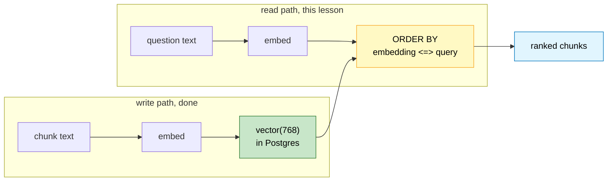
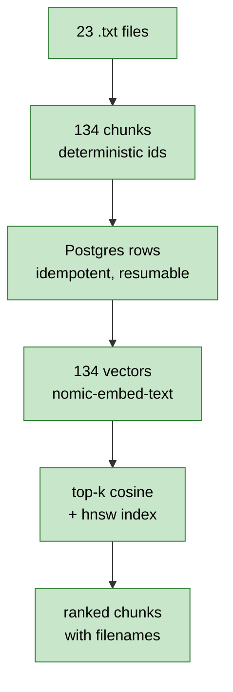

# Lesson 5. The first real search

## Where we are



Your database holds 23 documents, 134 chunks, 134 vectors, no orphans. I
checked.

The read path is the write path run backwards, and that symmetry is the reason
any of this works. A question becomes a vector using the same model, in the
same space, so "closest vector" means "most similar meaning". Nothing else in
the system needs to understand English.

By the end of this lesson you type a question and get back the chunks that
answer it.

---

## What it looks like when it works

I ran four questions against your corpus. Real output, your data.

```text
Q: Who runs NVIDIA?
   nvidia.txt         #0  sim=0.7241  NVIDIA Corporation is a technology company led by CEO Jens
   nvidia.txt         #1  sim=0.6735  Microsoft is one of NVIDIA's largest customers. The compan
   jensen_huang.txt   #1  sim=0.6377  San Jose, California, at age 30 and has remained its presi
   jensen_huang.txt   #0  sim=0.6342  Jen-Hsun "Jensen" Huang (Chinese: ...)
   microsoft.txt      #1  sim=0.5868  In 2019 and 2023, Microsoft invested a total of approximat
```

The top hit is the right sentence, and the word "runs" appears nowhere in it.
The chunk says "led by CEO". Two of the next three hits are the Jensen Huang
document, which the query never named. This is the thing keyword search cannot
do, and it took us four lessons to earn it.

Now a less flattering one:

```text
Q: Which cloud provider does OpenAI use?
   microsoft.txt      #1  sim=0.7272  In 2019 and 2023, Microsoft invested a total of approximat
   openai.txt         #0  sim=0.7254  OpenAI is an artificial intelligence research organization
   nvidia.txt         #1  sim=0.7055  Microsoft is one of NVIDIA's largest customers. The compan
   openai.txt         #1  sim=0.7021  Training modern language models requires enormous computat
   chatgpt.txt        #4  sim=0.6762  ake more accurate and up-to-date responses. It increased O
```

Read the scores. The top five are packed between 0.68 and 0.73, which is a
much flatter spread than the first question. Flat scores mean the query pulled
in things that are all *vaguely* on topic rather than one thing that is
clearly right. The answer is Azure, and getting there needs three facts joined
together: OpenAI is funded by Microsoft, Microsoft owns Azure, OpenAI trains on
Azure. Vector search returned neighbours of each fact separately. It has no way
to connect them.

Hold onto that. It's the argument for Arc C, and now you've seen it rather
than been told it.

One more worth noticing:

```text
Q: What is Anthropic focused on?
   anthropic.txt      #0  sim=0.7038
   anthropic.txt      #1  sim=0.6727
   anthropic.txt      #3  sim=0.6675
   anthropic.txt      #2  sim=0.6630
   anthropic.txt      #5  sim=0.6555   ← an ad campaign, ranked 5th
```

Five of the six Anthropic chunks, in near-arbitrary order, including one about
advertising that has nothing to do with the question. Every chunk that says
"Anthropic" a lot scores well. Similarity to a topic is not relevance to a
question, and no amount of tuning `LIMIT` fixes that. Lesson 13 will.

---

## Distance, similarity, and a 250x mistake

pgvector's operators return **distance**, where smaller is closer.

```text
   0.0                                                       2.0
    │                                                         │
    ├────────────┬─────────────┬──────────────┬───────────────┤
  identical   very close    unrelated      opposite
                 0.27          1.0            2.0

  similarity = 1 - distance      (for cosine)
       0.7241 = 1 - 0.2759
```

So `<=>` gives distance and humans want similarity, which means somewhere you
write `1 - (embedding <=> query)`. Where you write it matters enormously.

I tested four ways to order the same query over 20,000 vectors, with an HNSW
index present:

```text
 ORDER BY ...                          plan          time
 ───────────────────────────────────  ──────────   ─────────
 embedding <=> query                  Index Scan     0.337 ms
 1 - (embedding <=> query) DESC        Seq Scan      83.383 ms
 sim DESC   (aliased in SELECT)        Seq Scan      65.579 ms
 embedding <-> query   (L2 operator)   Seq Scan      68.328 ms
```

**All four return identical rows.** The first is 250 times faster.

This is my favourite kind of bug because there is no symptom. Order by
similarity and your results are correct, your tests pass, your code reads more
naturally than the alternative. You've just turned off the index. HNSW can
only serve an `ORDER BY` that is the bare distance operator it was built on.
Wrap it in arithmetic, negate it, alias it, and the planner can no longer match
it to the index, so it falls back to computing all 20,000 distances.

The last row is the same failure from a different angle. The index was built
with `vector_cosine_ops`, so it answers `<=>` and nothing else. Ask with `<->`
and you get a sequential scan, silently.

Two rules from this, and they are the only two things you need to remember:

```text
  1. ORDER BY the raw distance operator. Compute similarity in SELECT.
  2. The index opclass must match the operator you query with.
```

### Which operator, though

I checked whether it matters for our model:

```text
  L2 norm of a nomic-embed-text vector = 1.000000
```

The vectors are unit length. For unit vectors, cosine distance, L2 distance,
and inner product all produce the **same ordering**, only different numbers:

```text
  query "Who runs NVIDIA?", top hit under each operator

  <=>  cosine         nvidia.txt   0.275874
  <->  L2             nvidia.txt   0.742797
  <#>  neg inner      nvidia.txt  -0.724126
```

Same winner every time. So the choice is about which number you want to read,
not about quality. I'm picking `<=>` because `1 - distance` lands in a 0 to 1
range that means something to a human, and because cosine stays correct if a
future model returns vectors that aren't normalised.

---

## The index that does nothing for you

Now the part I want to be honest about. I measured HNSW at three corpus sizes:

```text
   rows    no index    with index    build     speedup
 ──────   ─────────   ──────────   ───────   ─────────
    134      2.57 ms      2.56 ms     0.0 s       1.0x
  5,000     29.58 ms      2.17 ms     0.5 s      13.6x
 50,000    204.59 ms      2.43 ms    17.9 s      84.2x
```

At your corpus size the index buys you nothing. Not "a little", nothing: 2.57
against 2.56 milliseconds, and the query plans come out with identical cost
estimates because the planner doesn't even choose it.

Look down the two middle columns instead of across the rows.

```text
  no index:    2.57  →  29.58  →  204.59      grows with row count
  with index:  2.56  →   2.17  →    2.43      flat
```

That flat column is the whole point. A sequential scan computes every distance,
so its cost is linear in corpus size. HNSW walks a graph of neighbours and
touches a small fraction of the rows, so it stays roughly constant as the table
grows. The build cost goes the other way, 0.5 seconds to 17.9 seconds, and it
keeps climbing.

So we build an index that does nothing today, because the alternative is
discovering at 50,000 chunks that every query takes a fifth of a second and
then building it under pressure. And it's one statement.

### The approximate part

HNSW is an approximate index. It can miss a true nearest neighbour that a
sequential scan would find. You trade a small amount of recall for that flat
line, and `hnsw.ef_search` is the knob, higher means better recall and slower
queries. We leave it at the default and revisit it in Arc E, where Recall@K
will finally let us see what the approximation costs rather than guess.

### Build after load, not before

Lesson 2 skipped the index deliberately, and this is the reason:

```text
  index first, then insert            insert first, then index
  ────────────────────────            ────────────────────────
  every INSERT updates the graph      one bulk build
  graph shaped by arrival order       graph shaped by the real
                                        data distribution
  slower ingestion                    slower once, then done
  worse graph quality                 better graph quality
```

An approximate index derives its structure from how the data is spread out. An
empty table has no spread, so a graph built incrementally as rows trickle in is
worse than one built when all the data is visible. Load, then index.

---

## Step 1. The result type

Open the stub:

```text
backend/app/domain/retrieval.py
```

```python
from dataclasses import dataclass


@dataclass
class SearchHit:
    chunk_id: str
    document_id: str
    filename: str
    chunk_index: int
    text: str
    similarity: float
```

This lives in `domain/` next to `Document` and `Chunk` because it's the same
kind of thing, a plain shape with no behaviour that other layers pass around.
In Lesson 12 the graph retriever will return these too, which is what lets the
hybrid ranker merge two sources without caring where a hit came from.

`similarity`, not `distance`. The database speaks distance and everything above
the database speaks similarity, so this is the boundary where we convert once.

---

## Step 2. The store

Open the stub:

```text
backend/app/vector/store.py
```

```python
from sqlalchemy import text

from app.domain.retrieval import SearchHit
from app.infrastructure.postgres import engine
from app.vector.embeddings import EmbeddingClient
from app.vector.repository import to_vector_literal


SEARCH_CHUNKS = """
SELECT
    chunk_id,
    document_id,
    chunk_index,
    text,
    metadata->>'filename' AS filename,
    1 - (embedding <=> CAST(:query AS vector)) AS similarity
FROM chunks
WHERE embedding IS NOT NULL
ORDER BY embedding <=> CAST(:query AS vector)
LIMIT :limit
"""


CREATE_HNSW_INDEX = """
CREATE INDEX IF NOT EXISTS chunks_embedding_hnsw_idx
    ON chunks
    USING hnsw (embedding vector_cosine_ops)
"""


class VectorStore:

    def __init__(
        self,
        client: EmbeddingClient | None = None,
    ):
        self.client = client or EmbeddingClient()

    def search(
        self,
        question: str,
        limit: int = 5,
    ) -> list[SearchHit]:

        query_vector = to_vector_literal(
            self.client.embed_query(question)
        )

        with engine.connect() as connection:

            rows = connection.execute(
                text(SEARCH_CHUNKS),
                {
                    "query": query_vector,
                    "limit": limit,
                },
            ).fetchall()

        return [
            SearchHit(
                chunk_id=row.chunk_id,
                document_id=row.document_id,
                filename=row.filename,
                chunk_index=row.chunk_index,
                text=row.text,
                similarity=float(row.similarity),
            )
            for row in rows
        ]


def create_index() -> None:
    with engine.begin() as connection:
        connection.execute(text(CREATE_HNSW_INDEX))


if __name__ == "__main__":

    create_index()

    store = VectorStore()

    questions = [
        "Who runs NVIDIA?",
        "What is Anthropic focused on?",
        "Which cloud provider does OpenAI use?",
    ]

    for question in questions:

        print()
        print("=" * 78)
        print("Q:", question)
        print()

        for hit in store.search(question, limit=5):

            preview = " ".join(hit.text.split())[:60]

            print(
                f"  {hit.similarity:.4f}  "
                f"{hit.filename:<22} #{hit.chunk_index}  "
                f"{preview}"
            )
```

### Details worth pausing on

**The distance expression appears twice, and that's deliberate.** Once in
`SELECT` wrapped in `1 - (...)` for the human-readable score, once bare in
`ORDER BY` so the index can serve it. Collapsing them into one aliased
expression is exactly the 250x mistake from earlier. If the duplication
bothers you, remember what it buys.

**`WHERE embedding IS NOT NULL`.** Right now every row has a vector so this
filters nothing. It stops mattering the moment you add a document and search
before the backfill finishes, which will happen. A NULL embedding sorts
unpredictably rather than harmlessly.

**`create_index` is a separate function, not part of `search`.** Building an
index is a one-time operation that takes 18 seconds at 50,000 rows. It belongs
next to the schema work, called deliberately, never on a query path.

**`IF NOT EXISTS` on the index.** Same reasoning as the whole of Lesson 2. Run
it as many times as you like.

**We reuse `to_vector_literal` from `repository.py`.** One place formats a
vector for Postgres. If we ever switch to `register_vector`, exactly one
function changes.

**`float(row.similarity)`.** Postgres returns `double precision`, which
psycopg hands over as a Python float already, but the annotation on the
dataclass says `float` and I'd rather the conversion be visible than assumed.

---

## Step 3. Run it

From `backend/`:

```bash
python -m app.vector.store
```

The index build is instant at 134 rows. Then three questions with five ranked
hits each. Your top hit for the NVIDIA question should be `nvidia.txt #0` at
roughly 0.72.

Scores will match mine closely but perhaps not exactly, since you appended the
Blackwell line to `nvidia.txt` during Lesson 4 and that shifted one chunk's
text.

---

## Verify

**1. The index exists and is the right kind.**

```bash
docker exec -it rag-postgres psql -U rag -d rag -c "\di+ chunks*"
```

Look for `chunks_embedding_hnsw_idx`. Then confirm the access method and
opclass, because this is what the 250x rule depends on:

```bash
docker exec -it rag-postgres psql -U rag -d rag -c "
SELECT indexname, indexdef FROM pg_indexes
WHERE tablename = 'chunks' AND indexname LIKE '%hnsw%';
"
```

The definition must contain `USING hnsw` and `vector_cosine_ops`. A different
opclass means your `<=>` queries silently seq scan.

**2. Ranking is sane, not just non-empty.** The failure mode to rule out is a
query that returns five rows in an order unrelated to the question.

```bash
python -c "
from app.vector.store import VectorStore
s = VectorStore()
for q, expected in [
    ('Who runs NVIDIA?', 'nvidia'),
    ('Who founded Amazon?', 'bezos'),
    ('What is Tesla known for?', 'tesla'),
]:
    top = s.search(q, limit=1)[0]
    ok = expected in top.filename
    print(f'{\"PASS\" if ok else \"FAIL\"}  {q:<26} -> {top.filename} ({top.similarity:.3f})')
"
```

Three passes. A FAIL here points at the embeddings rather than the query, so
re-check that `missing` is still 0 in the chunks table.

**3. Similarity is in range and ordered.** A similarity above 1.0 or below 0
means the `1 - distance` conversion is wrong, most likely from mixing up which
operator returns what.

```bash
python -c "
from app.vector.store import VectorStore
hits = VectorStore().search('Who runs NVIDIA?', limit=10)
sims = [h.similarity for h in hits]
print('count      :', len(sims))
print('in range   :', all(0.0 <= s <= 1.0 for s in sims))
print('descending :', sims == sorted(sims, reverse=True))
print('top / last : %.4f / %.4f' % (sims[0], sims[-1]))
"
```

All True, and the top score should be meaningfully higher than the last.

**4. The query plan uses the index, or explain why not.** At 134 rows Postgres
will legitimately choose a sequential scan, so this check is about learning to
read the plan rather than passing it.

```bash
docker exec -it rag-postgres psql -U rag -d rag -c "
EXPLAIN SELECT chunk_id FROM chunks
ORDER BY embedding <=> (SELECT embedding FROM chunks LIMIT 1) LIMIT 5;
"
```

You'll probably see `Seq Scan on chunks` with a `Sort`. That is the correct
decision on a 134-row table and not a bug. What matters is that you now know
the two shapes:

```text
  without index, or index unusable        with index in play
  ───────────────────────────────         ──────────────────
  Limit                                   Limit
    -> Sort                                 -> Index Scan using
         Sort Method: top-N heapsort             chunks_embedding_hnsw_idx
         -> Seq Scan on chunks                   Order By: (embedding <=> ...)
```

If you ever see `Sort` plus `Seq Scan` on a large table, you've either wrapped
the ORDER BY in arithmetic or mismatched the opclass.

**5. Prove the 250x rule to yourself.** Optional, and the most useful thing
here if you have five minutes. Run both plans and compare:

```bash
docker exec -it rag-postgres psql -U rag -d rag -c "
EXPLAIN ANALYZE SELECT chunk_id FROM chunks
ORDER BY 1 - (embedding <=> (SELECT embedding FROM chunks LIMIT 1)) DESC LIMIT 5;
"
```

At 134 rows the times will look the same as the previous check, because a seq
scan is cheap here and it was already choosing one. The point is the plan
shape, which is what diverges at scale.

---

## Then say "next"

Arc B is finished. Here's the whole of it:



You have a working vector RAG retriever. Plenty of production systems stop
here, and for questions like "who runs NVIDIA" that's a defensible place to
stop.

Then there's the OpenAI question from earlier, where the top five hits were all
0.68 to 0.73 and the actual answer required joining three separate facts.
Similarity cannot follow a relationship. It has no idea that Microsoft and
Azure are connected, or that a chunk about funding and a chunk about training
compute are two steps on the same path.

Arc C builds the thing that can. Lesson 6 starts it by designing the entity and
relation schema, and the first decision is a restrictive one: a closed set of
labels. I'll show you what an open-ended extraction does to a graph, because
it's the failure that quietly ruins most knowledge-graph projects before they
retrieve anything.
