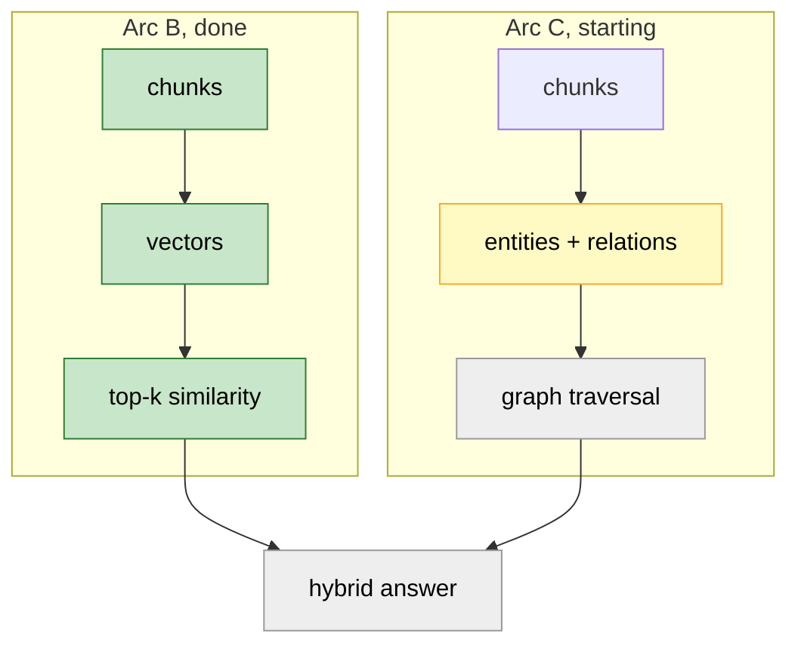
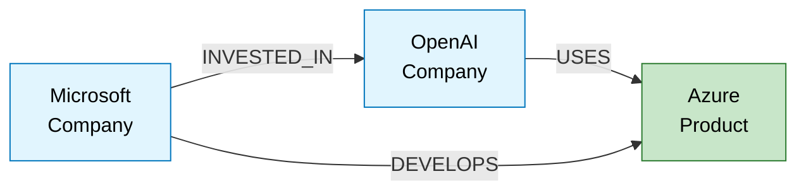
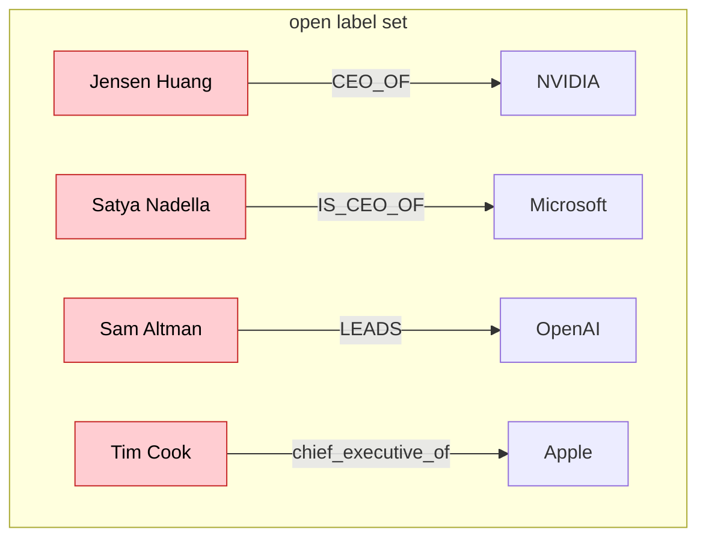

# Lesson 6. Designing the graph schema

## Where we are

Arc B is finished and working. Arc C starts here.



This lesson writes no LLM code and touches neither Neo4j nor Postgres. It
defines the shape of what we are about to extract. That sounds like the boring
preliminary, and it's the opposite: the label set you choose here determines
whether the graph can answer anything at all.

---

## The question that motivates all of Arc C

From Lesson 5, the query that vector search fumbled:

```text
Q: Which cloud provider does OpenAI use?
   microsoft.txt   sim=0.7272     ← ranked first
   openai.txt      sim=0.7254
   nvidia.txt      sim=0.7055
   openai.txt      sim=0.7021
   chatgpt.txt     sim=0.6762
```

Five hits inside 0.05 of each other, and no Azure anywhere. The answer needs
three separate facts joined:



Once those three edges exist, the answer is a two-hop walk from `OpenAI`.
Similarity cannot do this at any `LIMIT`, because "OpenAI" and "Azure" are not
textually similar. They're *connected*, which is a different property, and it
needs a different data structure.

That's the whole argument for Arc C. Everything in this lesson is in service of
producing those edges reliably.

---

## What I measured, and why it decides the design

I ran extraction on one 580-character chunk from `nvidia.txt` through four
local models. Here is the honest output.

`gemma3:4b` produced these relations:

```text
  Jensen Huang            CEO_OF     NVIDIA Corporation        correct
  NVIDIA Corporation      FOUNDED    NVIDIA Corporation        self-loop
  Jensen Huang            WORKS_AT   NVIDIA Corporation        correct
  NVIDIA H100 GPU         DEVELOPS   AI                        nonsense
```

and these entities:

```text
  NVIDIA Corporation      Company    correct
  Jensen Huang            Person     correct
  NVIDIA H100 GPU         Product    correct
  AI                      Product    an abstract idea, not a product
  machine learning        Product    same problem
```

`gemma3:1b` did worse:

```text
  NVIDIA Corporation      CEO_OF        Jensen Huang       direction reversed
  NVIDIA Corporation      FOUNDED       artificial intel.  nonsense
  NVIDIA Corporation      WORKS_AT      cloud providers    nonsense
  artificial intelligence Concept                          invented a type
```

Four distinct failure modes, and I want you to notice something about them:

```text
 failure                        can a prompt prevent it?   can code catch it?
 ─────────────────────────────  ────────────────────────   ─────────────────
 invented type "Concept"        asked nicely, ignored      yes, membership
 direction reversed             asked nicely, ignored      yes, type signature
 self-loop NVIDIA→NVIDIA        hard to phrase             yes, source != target
 abstract noun as Product       partly                     no, needs judgement
```

Three of the four are mechanically detectable. That asymmetry is the design
principle for this lesson.

**A prompt is a request. A schema is a rule.** I told `gemma3:1b` to use only
the types I listed. It invented `Concept` anyway. Every LLM extraction pipeline
you'll read about leans on prompt instructions for correctness, and the model
will violate them at a rate you cannot control. So we let the prompt ask
politely, and we let code refuse.

---

## The label set

Four entity types. Nine relation types. Both deliberately small.

```text
  Person      Satya Nadella, Jensen Huang, Sam Altman
  Company     Microsoft, NVIDIA, OpenAI, Anthropic
  Product     Azure, ChatGPT, AWS, H100
  Location    Redmond, Santa Clara, San Francisco
```

Each one has to earn its place by appearing in a question we want to answer.
I dropped `Technology` from my first draft for exactly this reason. "Is the
Blackwell architecture a Product or a Technology?" has no stable answer, so the
model would split the same entity across two labels at random, and a graph
where `Azure` is sometimes a Product and sometimes a Technology cannot be
traversed. When two labels are hard to tell apart, the graph pays for it
forever.

The relations, each with the entity types it may connect:

```text
 relation             source        target       answers
 ──────────────────   ───────────   ──────────   ──────────────────────────
 CEO_OF               Person        Company      who runs X
 FOUNDED              Person        Company      who started X
 WORKS_AT             Person        Company      who is at X
 INVESTED_IN          Company       Company      who funds X
 PARTNERS_WITH        Company       Company      who works with X
 COMPETES_WITH        Company       Company      who rivals X
 DEVELOPS             Company       Product      who makes X
 USES                 Company       Product      what X runs on
 HEADQUARTERED_IN     Company       Location     where X is
```

That source and target column is not documentation. It's the check that catches
`gemma3:1b`'s reversed `CEO_OF`. A `CEO_OF` edge from a Company to a Person
violates its signature, so we drop it rather than storing a fact that is
exactly backwards.

### Why a closed set at all

The alternative is letting the model name its own types. It sounds richer and
it destroys retrieval:



Four ways to say one thing. Now write the Cypher for "who runs this company".
You can't, because you'd have to know every phrasing the model happened to
invent across 134 chunks, and next month's run invents different ones. The
graph looks impressively detailed and answers nothing.

A closed set makes the query knowable:

```cypher
MATCH (p:Person)-[:CEO_OF]->(c:Company {name: $name}) RETURN p
```

One relation name, written once, correct forever. The cost is that you throw
away facts that don't fit your nine relations, and that cost is real. Pay it.
A graph that answers nine question shapes reliably beats one that answers forty
unpredictably.

---

## Deterministic entity IDs

Same idea as chunk IDs in Lesson 1, applied to entities.

```text
  "Microsoft Corporation"           "microsoft corporation"
  "microsoft corporation"     ──▶   normalise    ──▶   sha256("Company:...")
  "Microsoft  Corporation!"         lowercase,
                                    strip punctuation,
                                    collapse spaces
```

The ID is a function of type plus normalised name, so the same entity found in
20 different chunks produces the same ID 20 times, and `MERGE` in Neo4j
collapses them into one node without us tracking anything.

Note what this normalisation does **not** do. "Microsoft" and "Microsoft
Corporation" still produce different IDs, so they'll still be two nodes. That's
Lesson 8's problem, and it's a harder one than it looks. I'm flagging it now so
that when you inspect the graph after Lesson 7 and find both, you know it's
expected rather than broken.

---

## Step 1. The domain types

Open the stub:

```text
backend/app/domain/entity.py
```

```python
from dataclasses import dataclass, field


@dataclass
class Entity:
    entity_id: str
    name: str
    entity_type: str
    aliases: list[str] = field(default_factory=list)


@dataclass
class Relation:
    source_id: str
    target_id: str
    relation_type: str
    chunk_id: str
```

**`Relation.chunk_id` is the most important field in this lesson.** Every edge
records which chunk asserted it.

Most knowledge-graph tutorials skip this, and it's why their graph answers
can't be cited. Without it, a two-hop traversal returns "OpenAI uses Azure" and
you have no way to show the user where that came from, so you either present an
unsourced claim or drop the graph result. With it, every edge carries a route
back to the text:

```text
  graph answer                  provenance
  ────────────                  ──────────
  OpenAI -USES-> Azure    ──▶   chunk 7f3a...  ──▶  openai.txt #1
```

Lesson 10's Cypher returns chunk IDs, and Lesson 13's citation validator checks
them. Both depend on this one field existing from the start.

`aliases` is empty for now. Lesson 8 fills it.

---

## Step 2. The validated schema

Open the stub:

```text
backend/app/extraction/schemas.py
```

```python
import re
from dataclasses import dataclass, field
from enum import StrEnum
from hashlib import sha256

from pydantic import BaseModel, ValidationError, field_validator, model_validator


class EntityType(StrEnum):
    PERSON = "Person"
    COMPANY = "Company"
    PRODUCT = "Product"
    LOCATION = "Location"


class RelationType(StrEnum):
    CEO_OF = "CEO_OF"
    FOUNDED = "FOUNDED"
    WORKS_AT = "WORKS_AT"
    INVESTED_IN = "INVESTED_IN"
    PARTNERS_WITH = "PARTNERS_WITH"
    COMPETES_WITH = "COMPETES_WITH"
    DEVELOPS = "DEVELOPS"
    USES = "USES"
    HEADQUARTERED_IN = "HEADQUARTERED_IN"


# Which entity types each relation is allowed to connect.
RELATION_SIGNATURES: dict[RelationType, tuple[EntityType, EntityType]] = {
    RelationType.CEO_OF: (EntityType.PERSON, EntityType.COMPANY),
    RelationType.FOUNDED: (EntityType.PERSON, EntityType.COMPANY),
    RelationType.WORKS_AT: (EntityType.PERSON, EntityType.COMPANY),
    RelationType.INVESTED_IN: (EntityType.COMPANY, EntityType.COMPANY),
    RelationType.PARTNERS_WITH: (EntityType.COMPANY, EntityType.COMPANY),
    RelationType.COMPETES_WITH: (EntityType.COMPANY, EntityType.COMPANY),
    RelationType.DEVELOPS: (EntityType.COMPANY, EntityType.PRODUCT),
    RelationType.USES: (EntityType.COMPANY, EntityType.PRODUCT),
    RelationType.HEADQUARTERED_IN: (EntityType.COMPANY, EntityType.LOCATION),
}


def normalize_name(name: str) -> str:
    cleaned = re.sub(r"[^\w\s]", " ", name.lower())
    return " ".join(cleaned.split())


def build_entity_id(entity_type: str, name: str) -> str:
    raw = f"{entity_type}:{normalize_name(name)}"
    return sha256(raw.encode("utf-8")).hexdigest()


class ExtractedEntity(BaseModel):
    name: str
    type: EntityType

    @field_validator("type", mode="before")
    @classmethod
    def _tolerate_casing(cls, value):
        if isinstance(value, str):
            return value.strip().title()
        return value

    @field_validator("name")
    @classmethod
    def _require_real_name(cls, value):
        stripped = value.strip()
        if len(stripped) < 2:
            raise ValueError("name too short")
        return stripped


class ExtractedRelation(BaseModel):
    source: str
    type: RelationType
    target: str

    @field_validator("type", mode="before")
    @classmethod
    def _tolerate_casing(cls, value):
        if isinstance(value, str):
            return (
                value.strip()
                .upper()
                .replace(" ", "_")
                .replace("-", "_")
            )
        return value

    @model_validator(mode="after")
    def _reject_self_loop(self):
        if normalize_name(self.source) == normalize_name(self.target):
            raise ValueError("source and target are the same entity")
        return self


@dataclass
class Extraction:
    entities: list[ExtractedEntity] = field(default_factory=list)
    relations: list[ExtractedRelation] = field(default_factory=list)
    rejected: list[str] = field(default_factory=list)


def validate_extraction(payload: dict) -> Extraction:
    """Keep what is valid, record what is not. Never raise."""

    result = Extraction()

    for raw in payload.get("entities") or []:
        try:
            result.entities.append(ExtractedEntity.model_validate(raw))
        except ValidationError as error:
            result.rejected.append(
                f"entity {raw!r}: {error.errors()[0]['msg']}"
            )

    types_by_name = {
        normalize_name(entity.name): entity.type
        for entity in result.entities
    }

    for raw in payload.get("relations") or []:

        try:
            relation = ExtractedRelation.model_validate(raw)
        except ValidationError as error:
            result.rejected.append(
                f"relation {raw!r}: {error.errors()[0]['msg']}"
            )
            continue

        source_type = types_by_name.get(normalize_name(relation.source))
        target_type = types_by_name.get(normalize_name(relation.target))

        if source_type is None or target_type is None:
            result.rejected.append(
                f"relation {raw!r}: endpoint not in extracted entities"
            )
            continue

        expected_source, expected_target = RELATION_SIGNATURES[relation.type]

        if (source_type, target_type) != (expected_source, expected_target):
            result.rejected.append(
                f"relation {raw!r}: {relation.type} expects "
                f"{expected_source}->{expected_target}, "
                f"got {source_type}->{target_type}"
            )
            continue

        result.relations.append(relation)

    return result


if __name__ == "__main__":

    # Real output from gemma3:1b and gemma3:4b, garbage included.
    payload = {
        "entities": [
            {"name": "NVIDIA Corporation", "type": "Company"},
            {"name": "Jensen Huang", "type": "person"},
            {"name": "Azure", "type": "PRODUCT"},
            {"name": "artificial intelligence", "type": "Concept"},
            {"name": "X", "type": "Company"},
        ],
        "relations": [
            {"source": "Jensen Huang", "type": "ceo of",
             "target": "NVIDIA Corporation"},
            {"source": "NVIDIA Corporation", "type": "CEO_OF",
             "target": "Jensen Huang"},
            {"source": "NVIDIA Corporation", "type": "FOUNDED",
             "target": "NVIDIA Corporation"},
            {"source": "Microsoft", "type": "DEVELOPS",
             "target": "Azure"},
            {"source": "NVIDIA Corporation", "type": "MANAGES",
             "target": "Azure"},
        ],
    }

    result = validate_extraction(payload)

    print("KEPT ENTITIES")
    for entity in result.entities:
        print(
            f"   {entity.name:<24} {entity.type:<10} "
            f"{build_entity_id(entity.type, entity.name)[:12]}"
        )

    print()
    print("KEPT RELATIONS")
    for relation in result.relations:
        print(
            f"   {relation.source:<24} {relation.type:<10} {relation.target}"
        )

    print()
    print("REJECTED")
    for reason in result.rejected:
        print(f"   {reason}")

    assert len(result.entities) == 3, result.entities
    assert len(result.relations) == 1, result.relations
    assert len(result.rejected) == 6, result.rejected

    print()
    print("self-check passed")
```

### Details worth pausing on

**`validate_extraction` never raises.** One bad relation must not discard a
chunk's other nine good facts. So every item is validated on its own, survivors
are kept, and failures go into `rejected` with a reason. When we run this over
134 chunks in Lesson 7, that reject list is the only visibility you'll have
into how badly the model is behaving.

**The endpoint check catches dangling relations.** `Microsoft DEVELOPS Azure`
gets rejected in the self-check, even though it's a true fact, because
"Microsoft" was never extracted as an entity. A relation to an entity that
doesn't exist is unusable, and silently creating a node for it would fabricate
an entity the text may not support. Rejecting is the honest choice, and it also
tells you your entity extraction missed something.

**`_tolerate_casing` runs `mode="before"`.** I measured this: pydantic's
`StrEnum` validation is exactly case-sensitive, so `"person"`, `"PERSON"`, and
`"Person "` are all rejected by default. Models produce all three constantly.
Tolerant at the door, strict inside: normalise the case, then enforce
membership. Without this validator you throw away correct extractions over
capitalisation.

**`name too short` catches the `"X"` entity.** Single characters are almost
always parsing debris rather than real entities.

**`RELATION_SIGNATURES` is a plain dict, not a class hierarchy.** Nine entries,
read once per relation. This is the cheapest possible thing that catches
reversed edges.

---

## Step 3. Run the self-check

From `backend/`:

```bash
python -m app.extraction.schemas
```

```text
KEPT ENTITIES
   NVIDIA Corporation       Company    8f2c1a...
   Jensen Huang             Person     3d90bb...
   Azure                    Product    c17e04...

KEPT RELATIONS
   Jensen Huang             CEO_OF     NVIDIA Corporation

REJECTED
   entity {'name': 'artificial intelligence', 'type': 'Concept'}: ...
   entity {'name': 'X', 'type': 'Company'}: name too short
   relation {...'CEO_OF'...}: CEO_OF expects Person->Company, got Company->Person
   relation {...'FOUNDED'...}: source and target are the same entity
   relation {...'DEVELOPS'...}: endpoint not in extracted entities
   relation {...'MANAGES'...}: ...

self-check passed
```

One relation survives out of five. That ratio is the point of the lesson, and
those are not invented failures. `gemma3:1b` really did emit the reversed
`CEO_OF`, and `gemma3:4b` really did emit `NVIDIA FOUNDED NVIDIA`.

---

## Verify

**1. The self-check asserts.** If `python -m app.extraction.schemas` exits
without `self-check passed`, an assertion failed and the counts tell you which
rule is wrong.

**2. Casing tolerance works.**

```bash
python -c "
from app.extraction.schemas import ExtractedEntity, ExtractedRelation
for v in ['Company','company','COMPANY',' Company ','Organisation']:
    try: print(f'{v!r:14} -> {ExtractedEntity(name=\"NVIDIA\", type=v).type}')
    except Exception: print(f'{v!r:14} -> rejected')
for v in ['CEO_OF','ceo of','CEO-Of','MANAGES']:
    try: print(f'{v!r:14} -> {ExtractedRelation(source=\"a\", type=v, target=\"b\").type}')
    except Exception: print(f'{v!r:14} -> rejected')
"
```

The first four entity inputs become `Company`, `Organisation` is rejected. The
first three relation inputs become `CEO_OF`, `MANAGES` is rejected.

**3. Entity IDs are deterministic and normalisation-insensitive.**

```bash
python -c "
from app.extraction.schemas import build_entity_id as bid
a = bid('Company', 'Microsoft Corporation')
b = bid('Company', 'microsoft   corporation')
c = bid('Company', 'Microsoft Corporation!')
d = bid('Company', 'Microsoft')
e = bid('Person',  'Microsoft Corporation')
print('case/space/punct collapse :', a == b == c)
print('shorter name differs      :', a != d, '  <- Lesson 8 fixes this')
print('type is part of the id    :', a != e)
"
```

All three True. The middle one is the honest limitation: `Microsoft` and
`Microsoft Corporation` are still two nodes today.

**4. Every relation type has a signature.** A relation in the enum with no
entry in the dict would raise `KeyError` at validation time rather than
rejecting cleanly.

```bash
python -c "
from app.extraction.schemas import RelationType, RELATION_SIGNATURES
missing = [r for r in RelationType if r not in RELATION_SIGNATURES]
print('relation types      :', len(list(RelationType)))
print('with signatures     :', len(RELATION_SIGNATURES))
print('missing signatures  :', missing or 'none')
"
```

Nine, nine, none. This is the check that protects you when you add a tenth
relation type later and forget the signature.

---

## Then say "next", but read this first

There's a problem with Lesson 7 that I found while measuring, and it needs a
decision from you.

I timed one 580-character chunk through every local model you have:

```text
 model         per chunk    134 chunks    quality
 ───────────   ─────────   ──────────    ─────────────────────────────
 qwen3:8b        162.7 s      6.1 hrs    best
 qwen2.5:7b      136.1 s      5.1 hrs    best
 gemma3:4b        63.3 s      2.4 hrs    mixed, self-loops
 gemma3:1b        32.2 s      1.2 hrs    poor, reversed edges
```

Your Ollama is running on CPU. I checked `/api/ps` and it reports
`size_vram: 0`, and there's no `nvidia-smi` on the machine, so every token is
coming out of the processor at about 3 per second.

Extraction is not like embedding. Embedding was 39 seconds for the whole corpus
and we made it resumable and moved on. Extraction is hours per pass, and Lesson
7 is a lesson where you *iterate*: change the prompt, look at the rejects,
change it again. A five-hour feedback loop makes that impossible.

### We're moving extraction to Groq

You already had a Groq key in `.env` and the `groq` SDK 0.37.1 is already
installed as a dependency of `langchain-groq`. So I benchmarked the same chunk
against the same prompt:

```text
 model                    per chunk   134 chunks   schema violations
 ──────────────────────   ─────────   ──────────   ─────────────────
 qwen2.5:7b   (local)       136.1 s      5.1 hrs   self-loops, bad types
 gemma3:1b    (local)        32.2 s      1.2 hrs   reversed edges, bad types
 openai/gpt-oss-120b        1.56 s       3.5 min   none
 openai/gpt-oss-20b         1.22 s       2.7 min   none
```

111 times faster than local, and the output was clean on every check I ran:
no invented types, no self-loops, no reversed edges, no dangling endpoints.

Both `gpt-oss` models returned exactly this:

```text
  Jensen Huang         CEO_OF     NVIDIA Corporation
  NVIDIA Corporation   DEVELOPS   NVIDIA H100 Tensor Core GPU
```

Two relations, both correct. Notice it extracted 3 entities where `gemma3:1b`
extracted 13. It declined to call "AI" and "machine learning" products. Fewer,
better facts is the right trade for a graph, because every wrong edge is a
wrong answer with a citation attached.

The 20b model matched the 120b and ran faster, so we'll use the 20b. Bigger is
not automatically better, and I'd rather show you the measurement than the
assumption.

One thing I also found while checking your key: `settings.py` has
`env_file=".env"`, which pydantic-settings resolves against the current working
directory. Run anything from `backend/` and it looks for `backend/.env`, which
doesn't exist, so it silently loads nothing and every key comes back `None`.
Your key is fine, the path is wrong. Lesson 7 fixes it in one line.

Nothing to do about any of this now. Finish the schema and the self-check
above, then say "next".
