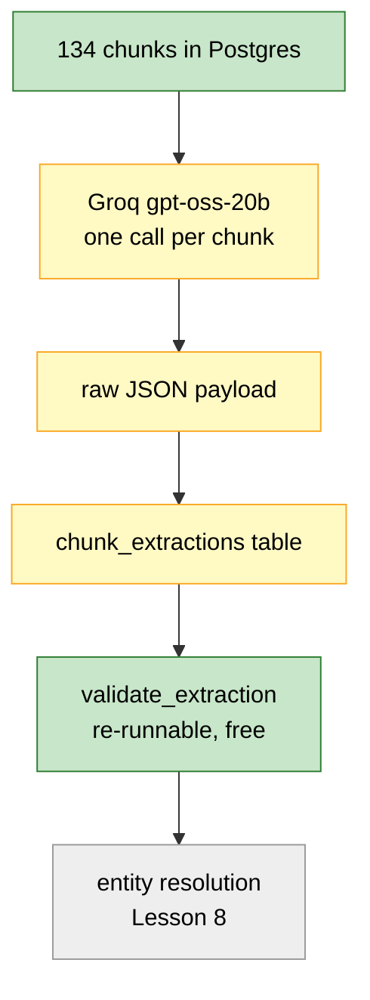
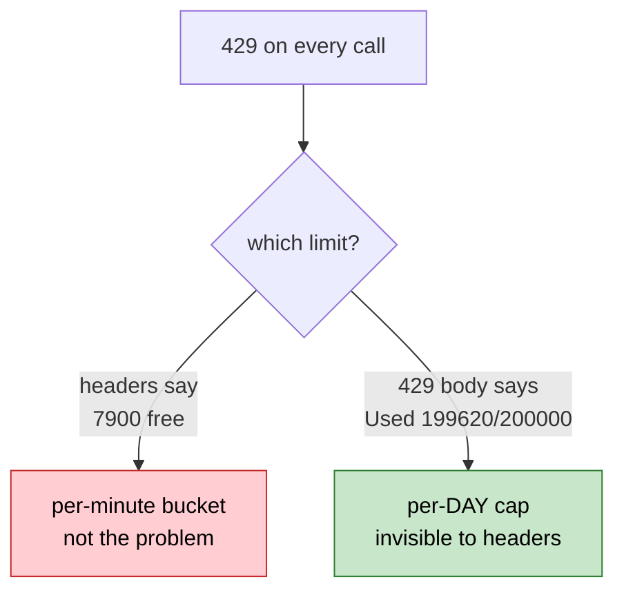

# Lesson 7. Extraction, and four wrong theories about a rate limit

This is the as-built version. The draft of this lesson assumed extraction
would be a short hop: point a fast hosted model at 134 chunks, wait three
minutes, done. It took four wrong diagnoses to find out why that was false,
and the wrong turns are the useful part.

---

## Where we are



---

## Step 1. The settings bug

`env_file=".env"` resolves against the current working directory, not the file
that declares it. Running from `backend/` looked for `backend/.env`, and when
the file was at the project root it silently loaded nothing. Every key read as
`None`, with no warning.

```python
from pathlib import Path

model_config = SettingsConfigDict(
    env_file=Path(__file__).parents[2] / ".env",
    env_file_encoding="utf-8",
    extra="ignore",
)
```

`parents[2]` from `app/config/settings.py` is `backend/`. Anchored to the file,
so it no longer depends on where you launched the process. Measured before and
after, running from a directory with no `.env` in it:

```text
  env_file=".env"              key loaded: False
  anchored to parents[2]       key loaded: True
```

Also added: `groq_model`, `groq_reasoning_effort`, `openrouter_*`,
`retrieval_top_k`, `hnsw_ef_search`, `resolution_threshold`.

---

## Step 2. Widening the ontology

`project_info.md` asks for five to ten entity types and eight to fifteen
relations. Lesson 6 had four and nine. Nothing was extracted yet, so widening
cost nothing then and would have cost a full re-extraction later.

Six entity types, fifteen relations. The `Product` and `Technology` split was
the one I argued against in Lesson 6, on the grounds that a label with no
statable rule gets applied at random. The fix is a rule, not avoidance:

```text
  Product     a named commercial offering      Azure, ChatGPT, H100
  Technology  a capability or architecture      CUDA, transformers, Blackwell
  Industry    a market a company operates in    cloud computing, semiconductors
```

Those descriptions live in `ENTITY_TYPE_HINTS` and are injected into the
prompt, so the rule the model sees and the rule the validator enforces come
from the same place.

Added relations: `ACQUIRED`, `SUPPLIES`, `OPERATES_IN`, `BASED_ON`,
`PREVIOUSLY_WORKED_AT`, `BOARD_MEMBER_OF`. Each has a signature in
`RELATION_SIGNATURES`, so a reversed edge is rejected rather than stored
backwards.

`confidence` was added to both extracted types, with a coercer, because models
emit `0.9`, `"0.9"`, `"high"`, and nothing at all for the same field:

```python
words = {"high": 0.9, "medium": 0.6, "low": 0.3}
```

A confidence field that throws on unexpected input is worse than no confidence
field.

---

## Step 3. Four wrong theories

Here is the sequence, because the shape of the mistake repeats.

### Theory 1: it will be fast

One chunk, measured: **1,956 tokens, 1,421 of them output.** `gpt-oss` is a
reasoning model, and the reasoning dominates.

```text
 model                    per chunk   134 chunks
 ──────────────────────   ─────────   ──────────
 qwen2.5:7b   (local)       136.1 s      5.1 hrs
 openai/gpt-oss-20b         1.22 s       2.7 min   <- the single-chunk test
 openai/gpt-oss-20b         6.24 s      13.9 min   <- 25 chunks, real prompt
```

The single-chunk number was measured on a shorter prompt and a shorter chunk.
Never extrapolate a batch estimate from one favourable sample.

### Theory 2: the JSON validator is flaky, so retry it

True, but I mis-tuned it. `json_validate_failed` is a **400** carrying
`'failed_generation': ''`, an empty string, so Groq's validator rejected a
generation it never produced. Non-deterministic at temperature 0, and the same
chunk succeeds on retry.

I had one retry policy covering both this and rate limits, with a 20 second
minimum wait because a 429 needs to sit out a window. So a 400 that would clear
on an immediate retry waited 20, 40, then 70 seconds. At a 43% failure rate
that is minutes per chunk.

```python
def _wait_for_error(state) -> float:
    error = state.outcome.exception() if state.outcome else None

    if isinstance(error, groq.RateLimitError):
        return min(60.0, 15.0 * state.attempt_number)

    return min(4.0, 0.5 * state.attempt_number)
```

Two failures, two waits. One retry policy for two unrelated failure modes is a
bug that hides as a config value.

### Theory 3: the failures are the prompt's fault

The 43% figure was itself a clue I misread. The rate rose when the prompt grew,
and dropped to near zero with `reasoning_effort="low"`:

```text
                        tokens/call   output   json_validate_failed
 default effort            1956        1421    ~43% of chunks
 reasoning_effort=low       733         198    near zero
```

Groq's JSON validator fails more the more output it has to validate. Cutting
the reasoning cut the failures as a side effect.

This reversed my earlier decision. I had picked default effort for "quality",
reasoning that 8 entities beat 3. But losing 43% of chunks entirely destroys
far more graph coverage than extracting fewer entities per surviving chunk.
A quality argument that ignores the failure rate is not a quality argument.

### Theory 4: I need to pace against tokens per minute

The headers said the limit was per minute:

```text
  x-ratelimit-limit-tokens         8000
  x-ratelimit-remaining-tokens     1082
  x-ratelimit-reset-tokens         51.885s
```

So I wrote a rolling 60-second window pacer. It did not help, and two things
were wrong with it.

First, `x-ratelimit-reset-tokens` later came back as **577ms**, not 60s. Groq
refills continuously, so a fixed 60-second window is the wrong model. Second, a
fresh pacer on process start knows nothing about what the previous run spent,
so every restart burst straight into a 429.

I replaced the model with the server's own accounting:

```python
def observe(self, headers) -> None:
    self.remaining = int(headers.get("x-ratelimit-remaining-tokens"))
    self.reset_in = parse_reset(headers.get("x-ratelimit-reset-tokens"))
```

Simpler, and correct across restarts. It still did not fix it.

### The actual answer

```text
Rate limit reached for model `openai/gpt-oss-20b` ...
on tokens per day (TPD): Limit 200000, Used 199620, Requested 1057
```

**200,000 tokens per day, and no response header reports it.** The
`x-ratelimit-*-tokens` headers describe only the per-minute bucket. My pacer
read 7,900 tokens available and was telling the truth about the wrong limit.

My own diagnostics had spent the budget. Every probe, every aborted run at
1,956 tokens a call, every threshold experiment.



Once exhausted it frees a few hundred tokens at a time as the rolling window
advances, so trivial calls succeed while real work keeps failing. That reads
exactly like flakiness, which is why it took four theories.

The lesson I would keep: **the 429 body said the answer the whole time.** I
built two pacers before reading the error text carefully. Structured telemetry
is not automatically the best telemetry, and I trusted the headers because they
were machine-readable rather than because they were complete.

---

## Step 4. What shipped

`app/llm/groq.py`:

- Header-driven pacer, corrected by every response.
- Per-error-type retry waits.
- `reasoning_effort` from settings, default `"low"`.
- A salvage path: if JSON mode fails every retry, re-ask without
  `response_format` and pull the first balanced `{...}` out of the text. Losing
  a chunk to a validator quirk is not acceptable when the fallback is 20 lines.
- `max_retries=0` on the SDK, because tenacity owns retrying. Leaving the SDK's
  default of 2 on top gives up to 12 attempts across two independent backoff
  schedules, which is impossible to reason about.

`chunk_extractions` stores the **raw** payload, not the validated result:

```text
  expensive and slow   ->  store it        the LLM call
  cheap and fast       ->  recompute it    validate_extraction()
```

Lesson 8 changes how names are normalised, which changes what validation
produces. Storing raw means re-validating all 134 chunks under new rules is
instant. Storing validated output would mean paying for extraction again.

Two more tables landed here for later lessons: `chunk_entities`, so a passage
can jump into the graph neighbourhood, and `routing_decisions`, because the
spec is right that you cannot reconstruct routing data after the fact.

### No base.py yet

`app/llm/base.py` stayed empty through this lesson. One provider needs no
interface, and an interface designed against one provider is usually the wrong
shape when the second arrives.

It got written in Lesson 15, when Groq and OpenRouter were both real. And then
it earned itself immediately: when Groq's daily cap hit mid-session, the
gateway failed over to OpenRouter and answered the query. Logged as
`provider: OpenRouterClient failovers: 2`. A fallback that has actually
fired once is worth more than one that has only been designed.

---

## Verify

**Every chunk has an extraction.**

```bash
docker exec -it rag-postgres psql -U rag -d rag -c "
SELECT (SELECT count(*) FROM chunks) AS chunks,
       (SELECT count(*) FROM chunk_extractions) AS extracted;"
```

**Re-running is free.** `python -m app.extraction.extractor` prints
`extracted: 0` and re-validates from stored payloads with no API calls.

**Spot-check one payload against its chunk text.** This is the check no
assertion replaces.

```bash
docker exec -it rag-postgres psql -U rag -d rag -c "
SELECT jsonb_pretty(e.payload) FROM chunk_extractions e
JOIN chunks c USING (chunk_id)
WHERE c.metadata->>'filename' = 'nvidia.txt' AND c.chunk_index = 0;"
```

Expect Jensen Huang as a Person, NVIDIA as a Company, `CEO_OF` between them,
and `DEVELOPS` pointing at the H100.

**Budget before you start.** The number that matters is not tokens per minute:

```text
  200,000 tokens per day
  ------------------------  =  about 270 chunks per day at 733 tokens each
  733 tokens per chunk
```

134 chunks is one comfortable pass. Two passes plus diagnostics is not.

---

## Then Lesson 8

Run this before you go:

```bash
docker exec -it rag-postgres psql -U rag -d rag -c "
SELECT lower(e->>'name') AS name, count(*) AS mentions
FROM chunk_extractions, jsonb_array_elements(payload->'entities') AS e
GROUP BY 1 ORDER BY 2 DESC LIMIT 20;"
```

You will see the same organisations under several spellings. Each variant is
currently its own `entity_id`, so a traversal starting at "Microsoft" misses
everything attached to "Microsoft Corporation".

Lesson 8 collapses them, and it is where I made the worst mistake in the
project: a name-matching heuristic that looked obviously correct and merged
`Dario Amodei`, `Daniela Amodei` and `Riccardo Amodei` into one person.
