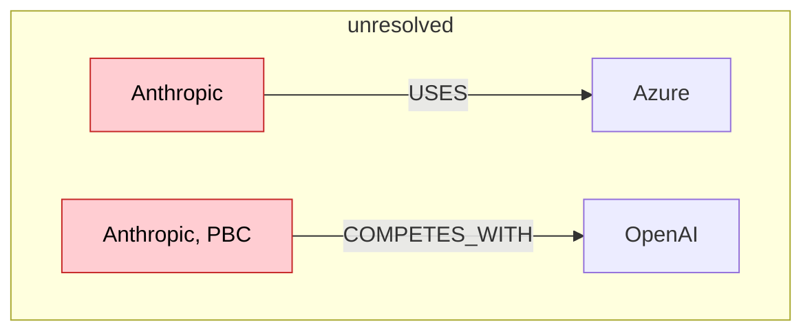
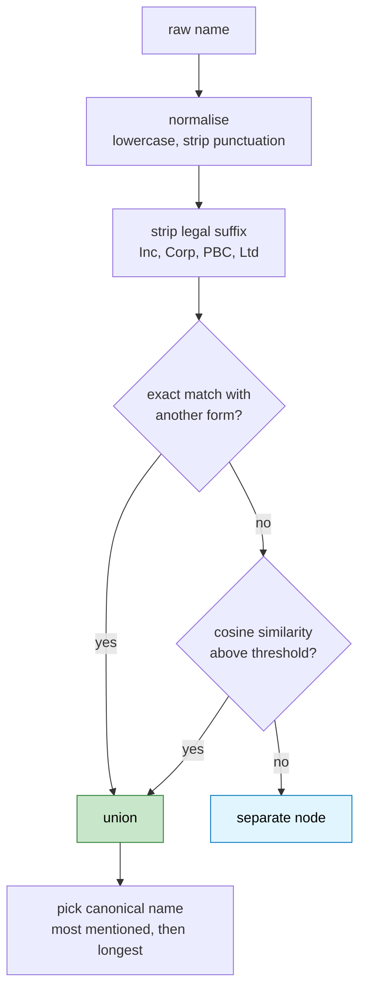

# Lesson 8. Entity resolution, and how I merged three people into one

`project_info.md` says this is "the hard part and the part that gets skipped".
It is right, and I got it wrong in a way worth showing, because the wrong
version looked more correct than the right one.

---

## The problem

Extraction produced these names, all referring to one company:

```text
  Anthropic
  Anthropic, PBC
```

and these, referring to one product:

```text
  Azure
  Windows Azure
  Microsoft Azure
```

Each variant currently hashes to its own `entity_id`, so each becomes its own
node. That breaks traversal in a way that produces no error:



A query starting at "Anthropic" finds the `USES` edge and misses the
`COMPETES_WITH` edge entirely, because it hangs off a different node with the
same meaning. The answer comes back confident and incomplete, which is worse
than an error.

---

## The design

Three passes, cheapest first, and always inside a single entity type.



Clustering within one entity type is what stops the Company "Microsoft" merging
with the Product "Microsoft Azure". Those two names are lexically close and
semantically unrelated, and type separation handles it for free.

Union-find does the clustering, because merges are transitive: if A merges with
B and B with C, all three are one node.

---

## The mistake

My first version added a fourth rule that felt obviously right. If one
normalised name contains another as a token, merge them. It was meant to catch
"google cloud" against "google cloud platform", which embeddings rate lower
than you would expect for short strings.

Here is what it actually produced on the real corpus:

```text
  Person      Dario Amodei    x15  <- Amodei, Daniela, Daniela Amodei,
                                      Dario, Riccardo Amodei
  Product     Microsoft Azure x9   <- Azure, Azure Sphere, Azure Web Apps,
                                      Azure Web Sites, Windows Azure
  Product     Claude          x8   <- Claude 4, Claude Code
  Technology  Nvidia AI systems x3 <- AI, generative AI
  Company     Anthropic       x9   <- Anthropic, PBC
  Company     NVIDIA          x2   <- Nvidia
```

The last two are correct. The first four are not.

**Dario, Daniela and Riccardo Amodei are three different people.** They all
share the token "amodei", so containment unioned them into one node. Every edge
belonging to Dario now also claims to belong to Daniela. The graph did not get
smaller and wrong-shaped, it started asserting facts that are false.

Azure Sphere, Azure Web Apps and Microsoft Azure are four distinct products.
Claude, Claude 4 and Claude Code are arguably three.

Five of seven clusters were wrong. Sharing a token is not being the same
entity, and I should have seen that from the rule rather than from the output.

### Why this failure is worse than the one it fixed

```text
  missed merge                      false merge
  ────────────                      ───────────
  one entity becomes two nodes      two entities become one node
  a traversal misses some edges     a traversal returns another
                                      entity's facts as this one's
  answer is incomplete              answer is wrong
  fixable later by merging          only fixable by re-resolving
                                      the whole graph
```

Incomplete is recoverable. Wrong, with a citation attached, is the failure mode
this entire project exists to avoid. **Precision is worth more than recall
here**, and the containment rule traded precision for recall without me
deciding to.

---

## Tuning the threshold properly

The spec says "compare with embedding similarity above a tuned threshold". I
had been treating 0.86 as a guess. So I labelled 23 pairs from the actual
extracted names and measured.

```text
  cosine   truth  exact   pair
  ──────   ─────  ─────   ────────────────────────────────────────
  1.0000   SAME   exact   Anthropic / Anthropic, PBC
  1.0000   SAME   exact   NVIDIA / Nvidia
  1.0000   SAME   exact   Microsoft Corporation / Microsoft
  0.9872   SAME           US Department of Defense / United States Dept...
  0.8962   SAME           Google Cloud Platform / Google Cloud
  0.8740   SAME           Tesla / Tesla Motors
  ─────────────────────── 0.84 threshold sits here ───────────────
  0.8355   DIFF           Dario Amodei / Riccardo Amodei
  0.8243   DIFF           Claude / Claude 4
  0.8226   DIFF           Dario Amodei / Daniela Amodei
  0.8217   DIFF           Azure Web Apps / Azure Web Sites
  0.8143   DIFF           Microsoft Azure / Azure Web Apps
  0.8057   SAME           Meta Platforms / Meta          <- missed
  0.7931   DIFF           AI / generative AI
  0.7199   DIFF           Microsoft / Microsoft Azure
  0.6737   DIFF           NVIDIA / NVIDIA H100
  0.6474   SAME           Amazon Web Services / AWS      <- missed
  0.4959   DIFF           Google / Alphabet
```

The sweep:

```text
  threshold   correct   false   missed   precision   recall
  ─────────   ───────   ─────   ──────   ─────────   ──────
  0.80             9        5        1        0.64     0.90
  0.82             8        4        2        0.67     0.80
  0.84             8        0        2        1.00     0.80
  0.86             8        0        2        1.00     0.80
  0.90             6        0        4        1.00     0.60
  0.99             5        0        5        1.00     0.50
  exact only       5        0        5        1.00     0.50
```

Three things fall out of that table.

**The threshold was never the problem.** 0.86 gives precision 1.00. The
containment rule was doing all the damage, and removing it fixed the resolver
without touching the number.

**There is a clean gap.** The worst true-negative pair sits at 0.8355 and the
worst true-positive at 0.8740. Anything between 0.84 and 0.87 separates them
perfectly on this data. That gap is narrow enough that I would not trust it on
a different corpus without re-measuring.

**Embeddings cannot do acronyms.** "Amazon Web Services" against "AWS" scores
0.6474, below every plausible threshold, and "Meta Platforms" against "Meta"
scores 0.8057. Both are real misses. No threshold catches them, because the
strings genuinely share no surface form. That needs a hand-maintained alias
list, and pretending otherwise would be the dishonest part of this lesson.

After removing containment, the real corpus produced four clusters, all correct:

```text
  Company     Anthropic                            <- Anthropic, PBC
  Product     Microsoft Azure                      <- Azure, Windows Azure
  Company     NVIDIA                               <- Nvidia
  Company     United States Department of Defense  <- US Department of Defense
```

---

## The code

`app/extraction/resolver.py`.

```python
LEGAL_SUFFIXES = {
    "inc", "incorporated", "corp", "corporation", "llc", "ltd",
    "limited", "plc", "pbc", "lp", "sa", "nv", "ag", "gmbh", "holdings",
}


def strip_legal_suffix(normalized: str) -> str:
    parts = normalized.split()

    while parts and parts[-1] in LEGAL_SUFFIXES:
        parts.pop()

    # A name that is nothing but suffixes keeps its original form.
    return " ".join(parts) or normalized
```

Only legal forms are in that set. `Platforms` is not there, which is why "Meta
Platforms" survives as its own node rather than being stripped to "Meta" by a
rule that would also mangle other names.

Canonical name selection:

```python
canonical = max(members, key=lambda n: (counts[(entity_type, n)], len(n)))
```

Most mentioned wins, length breaks ties. So "Microsoft" beats "Microsoft
Corporation" when the corpus prefers it, rather than because I decided short
names look nicer.

The `or normalized` fallback in `strip_legal_suffix` matters: a company
literally named "Holdings" would otherwise normalise to an empty string and
collide with every other empty result.

---

## Verify

**Clusters are right, and you have to read them.** There is no assertion for
this. Run it and look:

```bash
python -m app.extraction.resolver
```

Every alias line is a claim that two names mean the same thing. Read each one.
The Amodei bug was invisible in the counts and obvious in the list.

**Aliases resolve to one id.**

```bash
python -c "
from app.extraction.resolver import EntityResolver
lookup = EntityResolver(use_embeddings=False).resolve([
    ('Company','Microsoft'), ('Company','Microsoft Corporation'),
    ('Product','Microsoft Azure'), ('Product','Azure'),
])
same = lookup[('Company','Microsoft')].entity_id == lookup[('Company','Microsoft Corporation')].entity_id
split = lookup[('Product','Azure')].entity_id != lookup[('Company','Microsoft')].entity_id
print('company variants merged   :', same)
print('product not merged with co:', split)
"
```

Both True. The second is the type-separation guard, and it is the one that
stops the most embarrassing class of merge.

**Re-measure the threshold if you change corpus.** The gap between 0.8355 and
0.8740 is 0.04. That is not much margin, and it is a property of these names
rather than of embeddings in general.

---

## Then Lesson 9

Resolution feeds the graph writer. Now that "Anthropic" and "Anthropic, PBC"
produce one `entity_id`, `MERGE` collapses them into a single node and every
edge from either spelling attaches to the same place.

Lesson 9 also carries the field that makes the whole thing citable: every
relationship stores the `chunk_ids` that asserted it, so a two-hop answer can
point at the two sentences it came from.
