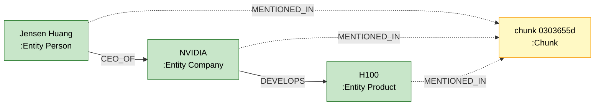
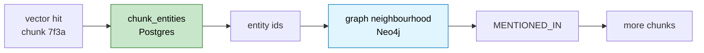

# Lesson 9. Writing the graph, and the field that makes it citable

Extraction produced triples. Resolution collapsed the name variants. This
lesson puts them into Neo4j in a way you can re-run, and attaches provenance to
every edge so a graph answer can point at the sentence that justified it.

---

## The shape



Two node labels only. `:Entity` carries `entity_type` as a property rather than
as a second label, so one Cypher pattern matches any entity and the type is a
filter when you want one. `:Chunk` is a stub node holding just the id,
filename, and index. The text stays in Postgres.

That last point is deliberate. Duplicating 134 chunks of text into Neo4j would
give two copies to keep in sync for no benefit, since anything that needs the
text can fetch it by `chunk_id`. The graph stores structure, Postgres stores
content, and the shared id is the join.

---

## MERGE, not CREATE

```text
  CREATE                            MERGE
  ──────                            ─────
  always makes a new node           makes one only if absent
  re-running doubles the graph      re-running changes nothing
  needs a "have I run this?" flag   needs nothing
```

Every write in this lesson is a `MERGE` keyed on a deterministic id. That is
the payoff for the sha256 ids from Lesson 0 and the resolution from Lesson 8:
the same input always produces the same key, so the second run is a no-op.

Uniqueness constraints back it up:

```cypher
CREATE CONSTRAINT entity_id_unique IF NOT EXISTS
FOR (e:Entity) REQUIRE e.entity_id IS UNIQUE
```

A constraint here is not decoration. `MERGE` without a unique constraint can
create duplicates under concurrent writes, and the constraint also creates the
index that makes the `MERGE` lookup fast rather than a full scan.

### Batching with UNWIND

One `MERGE` per entity means one round trip per entity. `UNWIND` sends the
whole list in a single statement:

```cypher
UNWIND $rows AS row
MERGE (e:Entity {entity_id: row.entity_id})
SET e.name = row.name, e.entity_type = row.entity_type,
    e.aliases = row.aliases, e.mentions = row.mentions
```

`MERGE` on the id alone, then `SET` the rest. Putting `name` inside the `MERGE`
pattern would make the name part of the match key, so a corrected canonical
name would create a second node instead of updating the first.

---

## The relationship type problem

Cypher cannot parameterise a relationship type. `MERGE (a)-[r:$type]->(b)` is
not valid, so the type has to be interpolated into the query string. That is
exactly the shape of a string-injection bug, and the type is coming from
extracted model output.

The guard is that the type never comes from the model directly. Relations are
grouped by type, and each type is checked against the enum before it reaches
`format`:

```python
for relation_type, rows in relation_rows.items():
    # The type comes from our enum, never from the model.
    assert relation_type in set(RelationType), relation_type
    run_write(
        MERGE_RELATION_TEMPLATE.format(relation_type=relation_type),
        rows=rows,
    )
```

Everything else in the statement is a bound parameter. The interpolated value
is drawn from a fifteen-member enum that a human wrote, and validation in
Lesson 6 already rejected anything outside it. Two layers: the validator drops
unknown types, and this assert would fail loudly if one somehow arrived.

---

## Provenance on every edge

This is the part most graph RAG walkthroughs skip.

```cypher
MERGE (a)-[r:USES]->(b)
ON CREATE SET r.chunk_ids = [row.chunk_id], r.confidence = row.confidence
ON MATCH  SET r.chunk_ids =
                  CASE WHEN row.chunk_id IN r.chunk_ids
                       THEN r.chunk_ids
                       ELSE r.chunk_ids + row.chunk_id END
```

An edge accumulates the chunks that asserted it. Two different passages both
saying Anthropic uses Azure produce one edge with two `chunk_ids`, which is
both a stronger claim and two citations.

```text
  without chunk_ids                 with chunk_ids
  ─────────────────                 ──────────────
  "OpenAI uses Azure"               "OpenAI uses Azure" [chunk 7f3a...]
  where did that come from?         -> openai.txt #1
  you either present an             -> the exact sentence
    unsourced claim or drop
    the graph result entirely
```

Lesson 10's Cypher returns those ids, Lesson 14's validator checks them against
what was retrieved, and the UI resolves them to text on click. All of it
depends on this one field existing from the first write.

The `CASE WHEN ... IN` guard is what keeps it idempotent. Without it, re-running
appends the same id every time and the list grows without bound.

---

## The Postgres side of the same key

The spec calls the shared chunk id "the whole trick". Neo4j can answer "which
chunks mention Microsoft", but the vector path lives in Postgres and needs the
reverse: given a chunk I just retrieved, which entities are in it. So the same
links are written to a `chunk_entities` table:

```sql
CREATE TABLE IF NOT EXISTS chunk_entities (
    chunk_id    TEXT NOT NULL REFERENCES chunks (chunk_id) ON DELETE CASCADE,
    entity_id   TEXT NOT NULL,
    entity_name TEXT NOT NULL,
    entity_type TEXT NOT NULL,
    PRIMARY KEY (chunk_id, entity_id)
)
```



Storing the link in both places is denormalisation, and the alternative is a
cross-database join at query time, which is not a thing. `ON DELETE CASCADE`
keeps it honest: editing a document drops its chunks, which drops its entity
links.

---

## One bug worth naming

Resolution can turn a valid edge into a self-loop. If the model extracted
`Anthropic PARTNERS_WITH Anthropic, PBC` and resolution collapsed both names
onto one node, the edge now points at itself.

```python
if not source or not target or source.entity_id == target.entity_id:
    skipped_relations += 1
    continue
```

Lesson 6 already rejected self-loops at the *name* level. This is the same
check at the *id* level, after resolution, and it is needed because resolution
runs later. A guard that was correct before a transformation is not
automatically correct after it.

The count is returned rather than swallowed, so a spike in `skipped_relations`
tells you resolution is merging too aggressively. That is the metric that would
have caught the Amodei bug from Lesson 8 numerically instead of by eye.

---

## Verify

**Idempotency, with frozen input.** This is the check that matters, and the
obvious version of it is wrong. Running `write_graph()` twice while extraction
is still adding rows shows growing counts and looks like a failure:

```text
  before: {'entities': 79,  'chunks': 22, 'relations': 50}
  after : {'entities': 91,  'chunks': 23, 'relations': 51}
  IDEMPOTENT: False        <- the input changed, not the writer
```

Freeze the payload, then write it twice:

```python
payload = build_graph_payload()      # once
write(payload); a = graph_counts()
write(payload); b = graph_counts()
assert a == b
```

```text
  frozen input, write #1: {'entities': 95, 'chunks': 24, 'relations': 55}
  frozen input, write #2: {'entities': 95, 'chunks': 24, 'relations': 55}
  IDEMPOTENT: True

  relation assertions fed in: 70  ->  distinct edges: 55
```

70 assertions collapsing to 55 edges is `MERGE` doing its job: fifteen of them
were the same fact asserted by a second chunk, and each of those became an
extra `chunk_id` on an existing edge rather than a duplicate edge.

**Every edge cites a chunk that exists.** A dangling `chunk_id` is a citation
that will 404 in the UI.

```python
rows = run_read('MATCH (:Entity)-[r]->(:Entity) RETURN r.chunk_ids AS ids')
ids = {i for r in rows for i in (r['ids'] or [])}
# compare against SELECT chunk_id FROM chunks
```

```text
  distinct chunk_ids on edges: 15
  all resolve to real chunks : True
  dangling                   : 0
```

**Read the graph in the browser.** `localhost:7474`, then:

```cypher
MATCH (a:Entity)-[r]->(b:Entity) RETURN a, r, b LIMIT 50
```

Look for edges that are obviously wrong. A `CEO_OF` pointing from a Company to
a Person would mean the type signature check failed. An entity named "AI" typed
as `Product` means the prompt's Product/Technology rule is not landing.

---

## Then Lesson 10

The graph is written and citable. Lesson 10 reads it, and the rule from the spec
is firm: **the model never emits Cypher.** It picks a template name and fills
parameters, and the query text is written once by a human and reviewed.

That is a security control, and it is also what makes graph answers
reproducible instead of dependent on what the model felt like generating.
