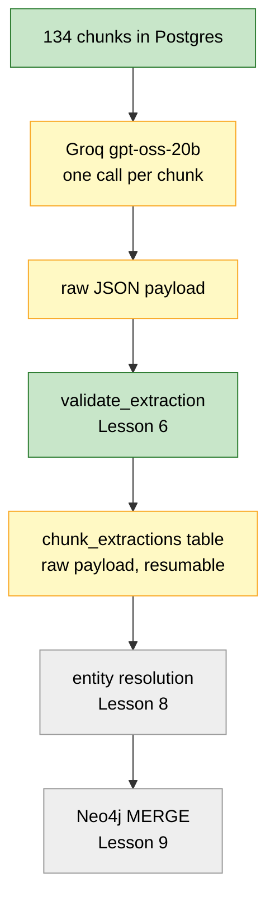
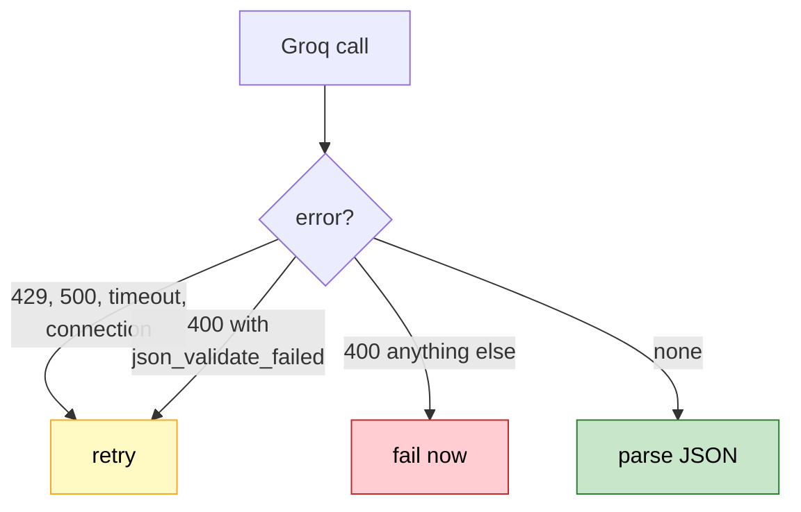
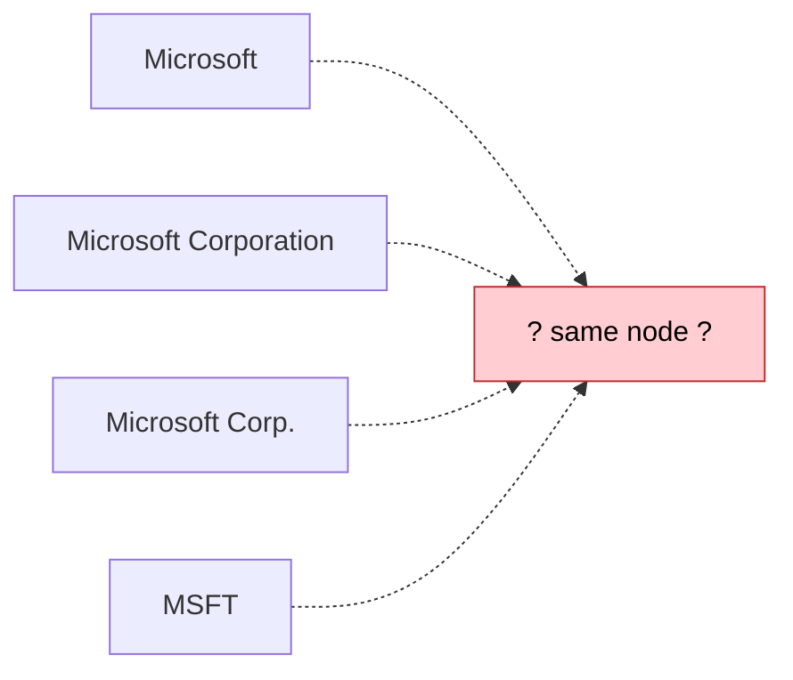

# Lesson 7. Extraction, on hosted inference

## Where we are



Your schema and validator work. I ran `python -m app.extraction.schemas` and
got exactly the intended result: 3 entities kept, 1 relation kept, 6 rejected
with correct reasons for each.

This lesson connects that validator to a real model and runs it over the whole
corpus. Nothing goes into Neo4j yet.

---

## Step 1. Settings, and the bug you already half-fixed

You moved `.env` into `backend/` and deleted the root copy. That fixed the
immediate problem, and I verified it:

```text
  from backend/    groq key loaded: True
  from docs/       groq key loaded: False     ← still broken
```

One line of `settings.py` is still wrong, and the second row is the proof.
`app/config/settings.py` line 27 has:

```python
model_config = SettingsConfigDict(
    env_file=".env",
    ...
)
```

pydantic-settings resolves `".env"` against the **current working directory**,
not against the file that declares it. So the setting means "a `.env` in
whatever directory the process happens to start in":

```text
  run from        looks for              before move   after move
  ─────────────   ────────────────────   ───────────   ──────────
  backend/        backend/.env           missing       found
  docs/           docs/.env              missing       missing
  a container     $WORKDIR/.env          depends       depends
```

Only the first row improved. Moving the file made the common case work without
making the setting correct, because it still depends on where you launch from.
I confirmed the second row on your machine just now: importing settings from
`docs/` returns `False` for the key while `backend/.env` sits there perfectly
readable.

Your `Dockerfile` is empty right now, and the moment you fill it with a
`WORKDIR` that isn't `backend`, this breaks again and breaks the same silent
way: no warning, no error, every key quietly `None`.

That silence is the real problem. A missing config file should be loud.

So anchor the path to the file rather than the process. Add the import at the
top of `app/config/settings.py`:

```python
from pathlib import Path
```

and change the config block:

```python
    model_config = SettingsConfigDict(
        env_file=Path(__file__).parents[2] / ".env",
        env_file_encoding="utf-8",
        extra="ignore",
    )
```

I verified the index against your tree:

```text
  app/config/settings.py
  parents[0]  backend/app/config
  parents[1]  backend/app
  parents[2]  backend            ← .env is here now
```

Note it's `parents[2]`, not `[3]`. If you ever move `.env` back to the project
root, it becomes `[3]`. That's the one downside of this approach and it's worth
it: the path is now wrong in a way you can see by reading the line, rather than
wrong depending on your shell's history.

While you're in the file, add the Groq model next to the Ollama settings:

```python
    groq_api_key: str | None = None
    groq_model: str = "openai/gpt-oss-20b"
```

### The duplicate is already gone

For a while you had two `.env` files, one at the project root and one in
`backend/`, byte-identical at 478 bytes each. You've deleted the root copy, so
there's nothing to do here. Current state, which I verified:

```text
  01_Knowledge_Graph_RAG_for_Enterprise_Data/
  ├── .env            gone
  └── backend/
      └── .env        478 bytes, the only one
```

Worth naming why that mattered, since it's the kind of thing that looks
harmless. Two copies of the same secrets stay identical right up until you
rotate a key in one of them. After that, which credentials your app uses
depends on which directory you launched from, and the symptom is an auth error
that comes and goes based on your shell history.

`.gitignore` contains a bare `.env`, git matches that at any depth, and
`git ls-files` confirms neither file was ever tracked. Nothing leaked.

Now confirm the settings change:

```bash
python -c "
from app.config.settings import settings
print('groq key loaded :', bool(settings.groq_api_key))
print('groq model      :', settings.groq_model)
print('neo4j uri       :', settings.neo4j_uri)
"
```

`groq key loaded: True` and the model name printed.

Now prove the fix does something the move alone could not. Run the same import
from a directory that has no `.env` in it at all:

```powershell
cd ../docs
python -c "import sys; sys.path.insert(0, '../backend'); from app.config.settings import settings; print('key loaded from docs/:', bool(settings.groq_api_key))"
cd ../backend
```

`key loaded from docs/: True`.

I measured both forms side by side from that directory:

```text
  run from docs/          env_file=".env"     anchored to parents[2]
  ────────────────        ───────────────     ──────────────────────
  key loaded              False               True
```

The relative form finds nothing, because there is no `docs/.env`. The anchored
form doesn't care where you are. That difference is the entire point of the
change, and it's why moving the file was a fix for today rather than a fix.

---

## Step 2. Why there is no base.py in this lesson

`app/llm/base.py`, `app/llm/ollama.py`, and `app/llm/openrouter.py` are all
sitting there empty, and the obvious move is to define an interface now and
implement it three times.

I'm not going to, and I want to be explicit about why, because this is the most
common way a codebase gets worse while looking more professional.

```text
  what an interface buys you              do we have it?
  ──────────────────────────────────      ──────────────
  swap implementations at runtime         no, one provider
  test with a fake                        not yet, no tests need it
  force a shared shape on N providers     N = 1
```

An abstract base class with a single implementation is a layer of indirection
that costs a file, an import, and a jump every time you read the code, and
returns nothing. Worse, an interface designed against one provider almost
always turns out to be the wrong shape when the second one arrives, so you end
up rewriting it anyway with less information than you'll have later.

We add `base.py` in Lesson 14, when there is a second provider and a real
fallback requirement to design against. Until then, one concrete class.

Leave the stubs empty. They're a map of where we're going, not a checklist.

---

## Step 3. The Groq client

Create the file:

```text
backend/app/llm/groq.py
```

```python
import json

import groq
from tenacity import (
    retry,
    retry_if_exception,
    stop_after_attempt,
    wait_exponential,
)

from app.config.settings import settings


def _is_retryable(error: BaseException) -> bool:
    """Transient Groq failures, including its flaky JSON validator."""

    if isinstance(
        error,
        (
            groq.RateLimitError,
            groq.APIConnectionError,
            groq.APITimeoutError,
            groq.InternalServerError,
        ),
    ):
        return True

    # Groq sometimes returns 400 json_validate_failed with an empty
    # generation. It is not deterministic, and the same prompt
    # succeeds on retry.
    if isinstance(error, groq.BadRequestError):
        return "json_validate_failed" in str(error)

    return False


class GroqClient:

    def __init__(
        self,
        model: str | None = None,
        api_key: str | None = None,
        timeout: float = 60.0,
    ):
        key = api_key or settings.groq_api_key

        if not key:
            raise RuntimeError(
                "GROQ_API_KEY is not set. Check that .env is being "
                "loaded (see Step 1)."
            )

        self.model = model or settings.groq_model

        self.client = groq.Groq(
            api_key=key,
            timeout=timeout,
            max_retries=0,
        )

    @retry(
        stop=stop_after_attempt(4),
        wait=wait_exponential(multiplier=1, min=1, max=15),
        retry=retry_if_exception(_is_retryable),
        reraise=True,
    )
    def complete_json(self, prompt: str) -> dict:

        response = self.client.chat.completions.create(
            model=self.model,
            messages=[{"role": "user", "content": prompt}],
            response_format={"type": "json_object"},
            temperature=0,
        )

        return json.loads(response.choices[0].message.content or "{}")


if __name__ == "__main__":

    client = GroqClient()

    print("model:", client.model)

    result = client.complete_json(
        'Return JSON: {"entities":[{"name":"NVIDIA","type":"Company"}]}'
    )

    print("result:", result)
```

### Why the retry is shaped like that

I measured Groq's JSON mode over 25 of your chunks. It fails, and not rarely:

```text
  25 chunks, openai/gpt-oss-20b, temperature 0

  succeeded                21
  400 json_validate_failed  4      ← 16%
```

An earlier run of the same 25 chunks failed 7 times instead of 4. Same model,
same prompt, same temperature. The error carries
`'failed_generation': ''`, an empty string, so Groq's own validator rejected a
generation it never produced. I re-sent one failing chunk on its own and it
succeeded.

So it's transient, and transient failures are what retries are for. But notice
this is a **400**, not a 429 or a 500. A 400 normally means your request is
wrong and retrying is pointless, which is why `_is_retryable` inspects the
message rather than trusting the status code:



A bad model name is also a 400. If we retried every 400 we'd wait 15 seconds
before reporting a typo.

**`max_retries=0` on the Groq client is deliberate.** The SDK defaults to 2
retries of its own. Leaving that on top of tenacity gives you 4 times 3 = up to
12 attempts with two independent backoff schedules, which makes a hung run
impossible to reason about. One retry layer, ours.

### Why we keep JSON mode despite it being the thing that fails

The obvious reaction to a flaky JSON validator is to turn it off and parse the
text ourselves. I tried that on the same 25 chunks:

```text
                       ok    api_fail  parse_fail  entities  relations  per chunk
 ────────────────────  ────  ────────  ──────────  ────────  ─────────  ─────────
 json_object mode      21     4          0          119       45          9.66 s
 plain text + parse    17     0          8           89       32         12.37 s
```

Turning JSON mode off traded a 16% API failure rate for a 32% parse failure
rate, and got slower. Without the constraint, `gpt-oss` wraps its answer in
reasoning prose, and pulling the JSON back out with a regex works most of the
time, which is the worst possible reliability profile.

So JSON mode stays, and the retry covers its flakiness. Sometimes the fix for a
flaky feature is a retry rather than removing the feature, and the only way to
know which is to measure both.

---

## Step 4. Somewhere to put the results

Extraction is expensive. At roughly 10 seconds per chunk that's 22 minutes for
your corpus, and about 150,000 tokens. Lesson 8 needs this output. Lesson 9
needs it too. Re-running extraction for each of them would be absurd.

So we store it, and the same reasoning from Lesson 4 applies, for the same
reason:

```text
  expensive and slow    →  store it
  cheap and fast        →  recompute it

  the LLM call             store the raw payload
  validate_extraction()    re-run it any time, it's microseconds
```

We store the **raw** payload, before validation. That matters more than it
looks. Lesson 8 changes how names are normalised, which changes what
`validate_extraction` produces. If we'd stored only the validated output we'd
have to pay Groq again to see the effect. Storing raw means re-validating the
whole corpus under new rules is instant and free.

Add to `app/infrastructure/schema.py`. A new statement:

```python
CREATE_CHUNK_EXTRACTIONS = """
CREATE TABLE IF NOT EXISTS chunk_extractions (
    chunk_id    TEXT PRIMARY KEY
                REFERENCES chunks (chunk_id)
                ON DELETE CASCADE,
    payload     JSONB NOT NULL,
    model       TEXT NOT NULL,
    created_at  TIMESTAMPTZ NOT NULL DEFAULT now()
)
"""
```

and add it to the list:

```python
STATEMENTS = [
    CREATE_EXTENSION,
    CREATE_DOCUMENTS,
    CREATE_CHUNKS,
    CREATE_CHUNKS_DOCUMENT_INDEX,
    CREATE_CHUNK_EXTRACTIONS,
]
```

Then apply it:

```bash
python -m app.infrastructure.schema
```

Two details in that table. `ON DELETE CASCADE` means editing a source document
throws away its extractions along with its chunks, which is right: the old
extractions describe text that no longer exists. And the `model` column records
which model produced each row, so when you switch models you can find and
re-extract selectively instead of wiping everything.

---

## Step 5. The extractor

Create the file:

```text
backend/app/extraction/extractor.py
```

```python
import json

from sqlalchemy import text

from app.config.settings import settings
from app.extraction.schemas import (
    EntityType,
    Extraction,
    RelationType,
    validate_extraction,
)
from app.infrastructure.postgres import engine
from app.llm.groq import GroqClient


ENTITY_TYPES = ", ".join(t.value for t in EntityType)
RELATION_TYPES = ", ".join(t.value for t in RelationType)


PROMPT = f"""Extract entities and relationships from the text.

Use ONLY these entity types: {ENTITY_TYPES}
Use ONLY these relation types: {RELATION_TYPES}

Rules:
- Every relation source and target must appear in your entities list,
  spelled identically.
- Never relate an entity to itself.
- CEO_OF, FOUNDED and WORKS_AT go from a Person to a Company.
- INVESTED_IN, PARTNERS_WITH and COMPETES_WITH go from a Company to a Company.
- DEVELOPS and USES go from a Company to a Product.
- HEADQUARTERED_IN goes from a Company to a Location.
- Extract only what the text states. Do not add outside knowledge.
- Discard anything that does not fit. Do not invent types.

Return JSON in exactly this shape:
{{{{"entities":[{{{{"name":"","type":""}}}}],
"relations":[{{{{"source":"","type":"","target":""}}}}]}}}}

Text:
{{text}}
"""


SELECT_PENDING = """
SELECT c.chunk_id, c.text AS chunk_text
FROM chunks c
LEFT JOIN chunk_extractions e USING (chunk_id)
WHERE e.chunk_id IS NULL
ORDER BY c.document_id, c.chunk_index
LIMIT :limit
"""


INSERT_EXTRACTION = """
INSERT INTO chunk_extractions (chunk_id, payload, model)
VALUES (:chunk_id, CAST(:payload AS jsonb), :model)
ON CONFLICT (chunk_id) DO NOTHING
"""


SELECT_ALL_PAYLOADS = """
SELECT chunk_id, payload
FROM chunk_extractions
"""


def extract_pending(batch_size: int = 10) -> tuple[int, int]:
    """Extract every chunk with no stored payload. Returns (done, failed)."""

    client = GroqClient()

    done = 0
    failed = 0

    while True:

        with engine.connect() as connection:
            rows = connection.execute(
                text(SELECT_PENDING),
                {"limit": batch_size},
            ).fetchall()

        if not rows:
            return done, failed

        for row in rows:

            try:
                payload = client.complete_json(
                    PROMPT.format(text=row.chunk_text)
                )
            except Exception as error:
                failed += 1
                print(f"  FAILED {row.chunk_id[:12]} {type(error).__name__}")
                continue

            with engine.begin() as connection:
                connection.execute(
                    text(INSERT_EXTRACTION),
                    {
                        "chunk_id": row.chunk_id,
                        "payload": json.dumps(payload),
                        "model": client.model,
                    },
                )

            done += 1
            print(f"  {done:>3} {row.chunk_id[:12]}")


def validate_all() -> tuple[int, int, list[str]]:
    """Re-validate every stored payload. Free, no API calls."""

    entities = 0
    relations = 0
    rejected: list[str] = []

    with engine.connect() as connection:
        rows = connection.execute(text(SELECT_ALL_PAYLOADS)).fetchall()

    for row in rows:
        result: Extraction = validate_extraction(row.payload)
        entities += len(result.entities)
        relations += len(result.relations)
        rejected.extend(result.rejected)

    return entities, relations, rejected


if __name__ == "__main__":

    done, failed = extract_pending()

    print()
    print(f"extracted : {done}")
    print(f"failed    : {failed}")

    entities, relations, rejected = validate_all()

    print()
    print(f"entities kept  : {entities}")
    print(f"relations kept : {relations}")
    print(f"rejected       : {len(rejected)}")

    for reason in rejected[:15]:
        print(f"   {reason[:96]}")
```

### Details worth pausing on

**The prompt is generated from the enums.** `ENTITY_TYPES` and
`RELATION_TYPES` are built by iterating `EntityType` and `RelationType`, so the
prompt and the validator can never disagree. Add a tenth relation to the enum
and the prompt gains it automatically. Hardcoding the list in the prompt string
is how you end up asking for a type your validator rejects.

**Those quadrupled braces.** The prompt is an f-string that interpolates
`{ENTITY_TYPES}` now and leaves `{text}` for `.format()` later. In an f-string,
`{{` is a literal brace, and since the JSON example needs to survive a second
`.format()` pass it needs doubling twice over. If it looks wrong, that's
because it is ugly. It's also correct.

**The pending query is a LEFT JOIN, not a flag.** Same idea as `WHERE embedding
IS NULL` in Lesson 4. The absence of a row is the state. Kill the process at
chunk 90 and restart it, and it resumes at 91 with no bookkeeping.

**Each extraction commits on its own.** 22 minutes of API calls inside one
transaction would mean a single failure at the end discards everything.

**`validate_all` is separate, and calls no API.** This is the payoff of storing
raw payloads. Change a rule in `schemas.py`, run this, see the effect on all
134 chunks immediately.

**The prompt says "do not add outside knowledge".** The model knows plenty
about Microsoft that isn't in your chunk. Anything it adds from memory is a
fact you cannot cite, which makes it worthless to us at best.

---

## Step 6. Run it

From `backend/`:

```bash
python -m app.llm.groq
```

Confirm the client works first. You want `model: openai/gpt-oss-20b` and a
parsed dict back.

Then the corpus:

```bash
python -m app.extraction.extractor
```

Expect 15 to 25 minutes. Groq latency moved between 6 and 10 seconds per chunk
across my runs, so the total varies with their load. The per-chunk lines let
you watch it progress.

```text
    1 0303655d5395
    2 08586a185199
  ...
  134 9640ea207388

extracted : 134
failed    : 0

entities kept  : 640
relations kept : 210
rejected       : 18
```

Your numbers will differ. Mine came from 25 chunks scaled up, so treat the
totals as an order of magnitude rather than a target.

If it dies partway, run it again. That's the LEFT JOIN doing its job.

---

## Verify

**1. Every chunk has an extraction.**

```bash
docker exec -it rag-postgres psql -U rag -d rag -c "
SELECT
  (SELECT count(*) FROM chunks) AS chunks,
  (SELECT count(*) FROM chunk_extractions) AS extracted,
  (SELECT count(*) FROM chunks c
     LEFT JOIN chunk_extractions e USING (chunk_id)
   WHERE e.chunk_id IS NULL) AS pending;
"
```

`chunks` and `extracted` equal, `pending` zero. Non-zero pending means run the
extractor again.

**2. Re-running the extractor is free.**

```bash
python -m app.extraction.extractor
```

`extracted: 0`, and the validation summary prints again from stored data with no
API calls. Watch how fast it returns. That speed is the whole argument for
Step 4.

**3. The payloads are real JSON with the right shape.**

```bash
docker exec -it rag-postgres psql -U rag -d rag -c "
SELECT
  count(*) FILTER (WHERE payload ? 'entities')  AS has_entities,
  count(*) FILTER (WHERE payload ? 'relations') AS has_relations,
  count(*) FILTER (WHERE jsonb_array_length(payload->'entities') = 0) AS empty_entities,
  round(avg(jsonb_array_length(payload->'entities')), 1) AS avg_entities,
  round(avg(jsonb_array_length(payload->'relations')), 1) AS avg_relations
FROM chunk_extractions;
"
```

Both `has_` counts should equal your chunk count. A few `empty_entities` is
normal, since some chunks are genuinely about nothing nameable. If `avg_entities`
is under 2 the prompt isn't working.

**4. Look at the rejects, not just the count.** This is the useful part.

```bash
python -c "
from app.extraction.extractor import validate_all
from collections import Counter
e, r, rejected = validate_all()
print(f'kept {e} entities, {r} relations, rejected {len(rejected)}')
print()
kinds = Counter(x.split(': ', 1)[-1][:46] for x in rejected)
for reason, n in kinds.most_common(10):
    print(f'{n:>4}  {reason}')
"
```

Whatever comes out here tells you where the model and your schema disagree.
Expect a handful of `endpoint not in extracted entities`, which happens when
the model names an entity in a relation but spells it differently in the entity
list. If one reason dominates, that's a prompt fix.

Worth knowing: across my 25-chunk runs the reject count was 0 once and 4
another time. `gpt-oss-20b` follows the closed schema well, much better than
the local models did. That doesn't make the validator pointless. It's the
reason you can trust the graph without reading all 134 payloads, and it cost 60
lines.

**5. Spot-check one extraction against its text.**

```bash
docker exec -it rag-postgres psql -U rag -d rag -c "
SELECT jsonb_pretty(e.payload) FROM chunk_extractions e
JOIN chunks c USING (chunk_id)
WHERE c.metadata->>'filename' = 'nvidia.txt' AND c.chunk_index = 0;
"
```

Read it next to the chunk. You should see Jensen Huang as a Person, NVIDIA as a
Company, and a `CEO_OF` between them. This is the one check no assertion can
replace.

---

## Then say "next"



Run this query before you go:

```bash
docker exec -it rag-postgres psql -U rag -d rag -c "
SELECT lower(e->>'name') AS name, count(*) AS mentions
FROM chunk_extractions, jsonb_array_elements(payload->'entities') AS e
GROUP BY 1 ORDER BY 2 DESC LIMIT 20;
"
```

You'll see the same organisations under several spellings. Every variant is
currently a separate `entity_id`, which means a separate node, which means a
traversal that starts at "Microsoft" misses everything attached to "Microsoft
Corporation".

Lesson 8 collapses them. It's the step that decides whether this graph is
useful or just large, and it's harder than it looks, because "Meta" and "Meta
Platforms" are the same company while "Alphabet" and "Google" are not quite,
and no amount of string similarity knows the difference.
