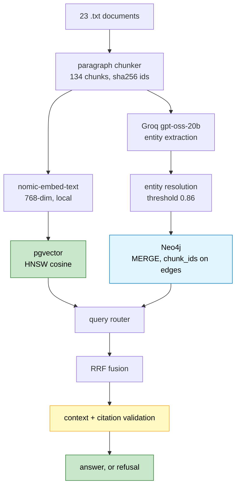

# Knowledge Graph RAG for Enterprise Data

Hybrid retrieval over a corpus of tech companies, executives, and products.
pgvector holds passages, Neo4j holds entities and relations, and both key on the
same `chunk_id` so every answer can be traced to the sentence that supports it.

The claim being tested is narrow: **vector search cannot follow a
relationship.** A question whose answer requires joining facts about different
entities fails on similarity alone, because "OpenAI" and "Azure" are not
textually similar. They are connected, which is a different property.

## Benchmark

Retrieval quality, 60 questions stratified by hop count, hybrid against a
vector-only baseline. Document recall at k=5.

| category | n | vector recall | hybrid recall | delta | vector hit | hybrid hit |
|---|---|---|---|---|---|---|
| single_hop | 20 | 0.95 | 0.95 | +0.00 | 1.00 | 1.00 |
| two_hop | 15 | 0.82 | 0.87 | **+0.05** | 1.00 | 1.00 |
| three_hop | 8 | 0.52 | 0.59 | **+0.07** | 1.00 | 1.00 |
| aggregation | 9 | 0.82 | 0.82 | +0.00 | 1.00 | 1.00 |
| out_of_scope | 8 | 1.00 | 1.00 | +0.00 | 1.00 | 1.00 |
| **all** | **60** | **0.85** | **0.87** | **+0.02** | | |

```text
  latency        median      p95
  ─────────      ──────      ───
  vector         310 ms      529 ms
  hybrid         324 ms      583 ms
```

Parity at one hop, and the gap widens as hops increase. That is the shape the
architecture predicts, and it is the only result here worth anything.

### Read this before quoting those numbers

Four caveats, because a benchmark you cannot criticise is a benchmark nobody
should believe.

**The question set is model-authored.** I wrote the 60 questions and their gold
labels from the corpus. That is weaker evidence than human labelling and it can
flatter the system, because the questions were written by something that had
already seen how the retrieval works. The set is committed at
`data/benchmark/questions.json` with readable gold labels so it can be
corrected by hand.

**The graph is incomplete.** These numbers come from a graph built on 55 of 134
chunks. Extraction hit Groq's 200,000 tokens-per-day cap and finished locally on
a slower model, so extraction quality is not uniform across the corpus. The
hybrid column should improve as coverage completes, which also means it is not a
final number.

**Retrieval only, no generation.** Recall costs no API tokens, because
embeddings are local and entity linking is string matching. End-to-end answer
accuracy needs a full generation pass and is not in this table yet.

**The deltas are small.** +0.05 and +0.07 on 15 and 8 questions is a handful of
documents, well inside noise for a set this size. The direction is consistent
across both multi-hop categories, which is the part I would defend; the
magnitudes are not.

**Four documents are thin.** `microsoft.txt`, `nvidia.txt`, `openai.txt`, and
`satya_nadella.txt` are about 1.2 KB against roughly 4 KB for the rest, giving
2 chunks each. Questions about those four underperform for corpus reasons, not
retrieval ones.

### The bug this benchmark caught

The first run said hybrid was **worse** than vector on every category:

```text
  two_hop      0.82 -> 0.48   (-0.34)
  aggregation  0.82 -> 0.45   (-0.37)
  all          0.85 -> 0.66   (-0.19)
```

23 of the 60 questions routed to graph-only, and that path returned graph facts
with **zero passages**. Recall collapsed because it was measuring graph coverage
alone on a sparse graph.

A traversal is an addition to the passage set, never a replacement for it.
Passages now always run, which also removed a branch and a special-case
fallback. That single change produced the table above.

## Architecture



Stack: FastAPI, Postgres 16 with pgvector, Neo4j 5, Ollama for embeddings, Groq
and OpenRouter for generation, React with Vite.

## Running it

```bash
docker compose up -d                          # postgres + neo4j
cd backend
python -m app.infrastructure.schema           # tables, idempotent
python -m app.vector.repository               # ingest + embed
python -m app.extraction.extractor            # LLM extraction, resumable
python -m app.graph.repository                # build graph, idempotent
python -m app.vector.store                    # HNSW index
uvicorn app.main:app --reload
```

```bash
cd frontend && npm install && npm run dev     # localhost:5173
```

Every pipeline step is safe to re-run. Ingestion skips unchanged documents by
content hash, embedding resumes from `WHERE embedding IS NULL`, extraction
resumes from a `LEFT JOIN`, and graph writes use `MERGE`.

```bash
# reproduce the table above, no API tokens needed
python -m app.evaluation.benchmark --retrieval-only

# full run including generation and answer accuracy
python -m app.evaluation.benchmark --out ../docs/benchmark.json
```

## What went wrong, and what it cost

The build log is in `docs/Instructions0.md` through `Instructions12.md`. The
findings worth carrying to another project:

**Groq's free tier caps 200,000 tokens per day and no header reports it.**
`x-ratelimit-remaining-tokens` describes only the per-minute bucket. I built two
pacers against those headers before reading the 429 body, which had said
`on tokens per day (TPD): Limit 200000, Used 199620` the whole time. Structured
telemetry is not automatically complete telemetry.

**`reasoning_effort="low"` cut cost and failures together.** Default effort
measured 1,956 tokens per call with 43% of chunks failing every retry; low
effort measured 733 tokens and near zero failures, because Groq's JSON
validator fails more the more output it has to check.

**One retry policy for two failure modes is a bug.**
`json_validate_failed` is a transient 400 that clears instantly. Giving it the
long wait a 429 needs turned a 25% failure rate into minutes per chunk.

**Ordering by similarity instead of distance costs 250x, silently.**
`ORDER BY embedding <=> q` uses the HNSW index. `ORDER BY 1 - (embedding <=> q)
DESC` returns identical rows and quietly stops using it.

**Name containment is not entity identity.** A token-overlap merge rule looked
obviously correct and combined `Dario Amodei`, `Daniela Amodei`, and `Riccardo
Amodei` into one person. Removing it and keeping a measured 0.86 cosine
threshold gave precision 1.00 at recall 0.80 on 23 labelled pairs. A false merge
invents facts; a missed merge only splits a node.

**Batching gained 19%, not 10x.** Ollama loops internally rather than running a
parallel forward pass, so batching only saves HTTP round trips. Throughput was
flat above batch size 8.

**The HNSW index does nothing at this scale.** 2.57 ms against 2.56 ms at 134
rows, with identical plan costs. It is 84x at 50,000 rows, where the indexed
query time stays flat while the scan grows linearly. Build it anyway, after
loading.

## Known gaps

- Extraction coverage is 55 of 134 chunks. Re-run the extractor to finish.
- End-to-end answer accuracy is not benchmarked yet, only retrieval recall.
- Acronyms defeat entity resolution. "Amazon Web Services" against "AWS" scores
  0.6474, below any usable threshold. That needs a hand-maintained alias list.
- `ingestion/cleaner.py` is empty. The corpus is plain text, so PDF and HTML
  input is unbuilt.
- `hnsw.ef_search` is configurable but untuned, because the index is not used at
  this corpus size.
